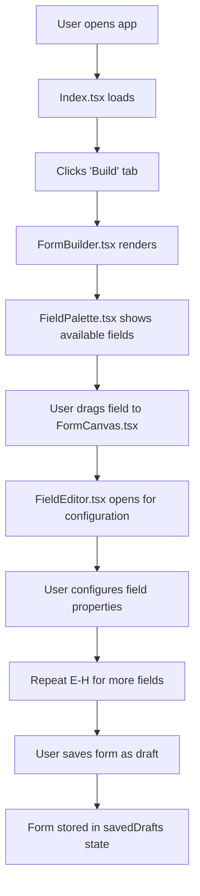
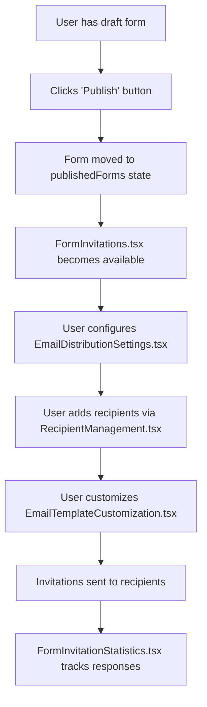
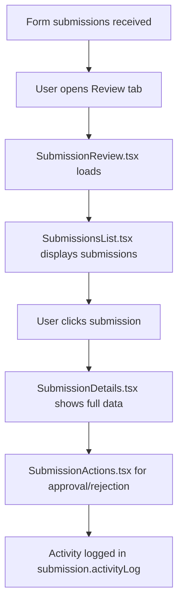

# Form Builder Application - File Structure & Flow Documentation

## Table of Contents
1. [Application Overview](#application-overview)
2. [Directory Structure](#directory-structure)
3. [File Responsibilities](#file-responsibilities)
4. [Application Flow](#application-flow)
5. [Component Hierarchy](#component-hierarchy)
6. [Data Flow Architecture](#data-flow-architecture)

---

## Application Overview

The Form Builder is a comprehensive enterprise application for creating, managing, and analyzing forms with advanced features like scoring, email distribution, and submission management.

**Core Capabilities:**
- Dynamic form building with drag & drop
- Email distribution and invitation management
- Submission review and approval workflows
- Analytics and reporting
- Scoring and risk assessment
- File attachment management

---

## Directory Structure

```
src/
├── main.tsx                          # Application entry point
├── App.tsx                           # Main app wrapper with routing
├── index.css                         # Global styles and design system
├── vite-env.d.ts                     # TypeScript environment definitions
│
├── components/                       # Reusable UI components
│   ├── ui/                          # Base UI component library (Shadcn)
│   │   ├── accordion.tsx            # Collapsible content panels
│   │   ├── alert-dialog.tsx         # Modal confirmation dialogs
│   │   ├── alert.tsx                # Notification banners
│   │   ├── button.tsx               # Clickable buttons
│   │   ├── card.tsx                 # Content containers
│   │   ├── dialog.tsx               # Modal windows
│   │   ├── input.tsx                # Text input fields
│   │   ├── select.tsx               # Dropdown selections
│   │   ├── tabs.tsx                 # Tab navigation
│   │   ├── toast.tsx                # Popup notifications
│   │   └── ... (other UI primitives)
│   │
│   ├── forms/                       # Form-specific components
│   │   ├── EmailDistributionSettings.tsx    # Email invitation configuration
│   │   ├── EmailTemplateCustomization.tsx  # Email template editor
│   │   ├── FormInvitationStatistics.tsx    # Invitation analytics
│   │   ├── FormSharingOptions.tsx          # URL sharing and embedding
│   │   └── RecipientManagement.tsx         # Email recipient management
│   │
│   ├── reports/                     # Reporting components
│   │   ├── ReportCharts.tsx         # Chart visualizations
│   │   └── ReportCustomization.tsx  # Report configuration
│   │
│   ├── submissions/                 # Submission management components
│   │   ├── SubmissionActions.tsx    # Approve/reject actions
│   │   ├── SubmissionCard.tsx       # Individual submission display
│   │   ├── SubmissionDetails.tsx    # Detailed submission view
│   │   └── SubmissionsList.tsx      # Submissions listing
│   │
│   ├── Analytics.tsx                # Main analytics dashboard
│   ├── EmailTracking.tsx            # Email performance tracking
│   ├── FieldEditor.tsx              # Field configuration panel
│   ├── FieldPalette.tsx             # Available form fields
│   ├── FileAttachmentManager.tsx    # File upload management
│   ├── FormBuilder.tsx              # Main form building interface
│   ├── FormCanvas.tsx               # Form preview and editing area
│   ├── FormCategoryManager.tsx      # Form categorization
│   ├── FormInvitations.tsx          # Invitation management hub
│   ├── FormLibrary.tsx              # Template library
│   ├── FormPreview.tsx              # Real-time form preview
│   ├── ReportGeneration.tsx         # Report creation interface
│   ├── ScoringSettings.tsx          # Scoring configuration
│   ├── SettingsPanel.tsx            # Form settings management
│   ├── SubmissionReview.tsx         # Submission review interface
│   ├── WeightageAndScoringSettings.tsx  # Advanced scoring setup
│   └── WeightageEditor.tsx          # Individual field scoring
│
├── contexts/                        # React context providers
│   └── ThemeContext.tsx             # Theme management (light/dark mode)
│
├── data/                           # Sample and static data
│   └── sampleSubmissions.ts        # Demo submission data
│
├── hooks/                          # Custom React hooks
│   ├── use-mobile.tsx              # Mobile device detection
│   ├── use-toast.ts                # Toast notification system
│   └── useFormStatus.ts            # Form status management
│
├── lib/                            # Utility libraries
│   └── utils.ts                    # Common utility functions
│
├── pages/                          # Page components
│   ├── Index.tsx                   # Main dashboard page
│   └── NotFound.tsx                # 404 error page
│
├── types/                          # TypeScript type definitions
│   └── form.ts                     # All form-related interfaces
│
└── utils/                          # Specialized utilities
    ├── chartRenderer.ts            # Chart generation utilities
    └── reportGenerator.ts          # Report creation utilities
```

---

## File Responsibilities

### Core Application Files

| File | Responsibility | Usage |
|------|---------------|-------|
| `main.tsx` | Application bootstrap and React root creation | Entry point - initializes entire app |
| `App.tsx` | Main wrapper with providers and routing | Central hub - wraps all features |
| `index.css` | Global styles, design system, theme variables | Used by all components for consistent styling |

### Page Components

| File | Responsibility | Navigation |
|------|---------------|------------|
| `pages/Index.tsx` | Main dashboard with all features and navigation | Primary interface - contains all major functionality |
| `pages/NotFound.tsx` | 404 error page for invalid routes | Fallback for unmatched URLs |

### Core Form Building Components

| Component | Responsibility | Used By | Key Features |
|-----------|---------------|---------|--------------|
| `FormBuilder.tsx` | Main form creation interface | Index.tsx (Build tab) | 3-column layout, field management, responsive design |
| `FormCanvas.tsx` | Interactive form preview area | FormBuilder.tsx | Drag & drop, field arrangement, real-time preview |
| `FieldPalette.tsx` | Available form field types | FormBuilder.tsx | Field categories, drag source |
| `FieldEditor.tsx` | Field configuration panel | FormBuilder.tsx | Validation, scoring, properties |
| `FormLibrary.tsx` | Template management | Index.tsx (Library tab) | Templates, categories, reusable forms |
| `FormPreview.tsx` | Read-only form display | FormBuilder.tsx | User-facing form appearance |

### Form Management Components

| Component | Responsibility | Used By | Business Function |
|-----------|---------------|---------|-------------------|
| `FormInvitations.tsx` | Invitation management hub | Index.tsx (when published) | Email distribution, sharing, statistics |
| `FormSharingOptions.tsx` | URL and embed code generation | FormInvitations.tsx | Public access, embedding, PDF export |
| `EmailDistributionSettings.tsx` | Email invitation configuration | FormInvitations.tsx | Recipient settings, reminders |
| `EmailTemplateCustomization.tsx` | Email template editor | FormInvitations.tsx | Custom invitation messages |
| `RecipientManagement.tsx` | Email recipient handling | FormInvitations.tsx | Add/edit recipients, status tracking |
| `FormInvitationStatistics.tsx` | Invitation analytics | FormInvitations.tsx | Completion rates, response tracking |

### Submission Management Components

| Component | Responsibility | Used By | Workflow Stage |
|-----------|---------------|---------|----------------|
| `SubmissionReview.tsx` | Main submission interface | Index.tsx (Review tab) | Submission overview, bulk actions |
| `SubmissionsList.tsx` | Submissions listing | SubmissionReview.tsx | Filtering, sorting, status management |
| `SubmissionCard.tsx` | Individual submission display | SubmissionsList.tsx | Quick view, actions |
| `SubmissionDetails.tsx` | Detailed submission view | SubmissionCard.tsx | Full responses, scoring, attachments |
| `SubmissionActions.tsx` | Approval/rejection interface | SubmissionDetails.tsx | Review workflow, comments |

### Analytics and Reporting

| Component | Responsibility | Used By | Data Insights |
|-----------|---------------|---------|---------------|
| `Analytics.tsx` | Main analytics dashboard | Index.tsx (Dashboard tab) | Performance metrics, trends, KPIs |
| `ReportGeneration.tsx` | Report creation interface | Index.tsx (Reports tab) | Custom reports, export options |
| `ReportCharts.tsx` | Chart visualizations | Analytics.tsx, ReportGeneration.tsx | Data visualization, insights |
| `ReportCustomization.tsx` | Report configuration | ReportGeneration.tsx | Filters, formatting, scheduling |
| `EmailTracking.tsx` | Email performance tracking | Analytics.tsx | Open rates, click tracking |

### Scoring and Assessment

| Component | Responsibility | Used By | Assessment Type |
|-----------|---------------|---------|-----------------|
| `ScoringSettings.tsx` | Basic scoring configuration | SettingsPanel.tsx | Enable/disable, thresholds |
| `WeightageAndScoringSettings.tsx` | Advanced scoring setup | SettingsPanel.tsx | Risk categories, weightage |
| `WeightageEditor.tsx` | Individual field scoring | FieldEditor.tsx | Field-level scoring, risk assignment |

### Utility and Support Components

| Component | Responsibility | Used By | Function |
|-----------|---------------|---------|----------|
| `SettingsPanel.tsx` | Form configuration | Index.tsx (Settings context) | All form settings, permissions |
| `FormCategoryManager.tsx` | Form categorization | FormBuilder.tsx | Organization, templates |
| `FileAttachmentManager.tsx` | File upload handling | FormBuilder.tsx | Document requirements, validation |

---

## Application Flow

### 1. User Journey: Creating a Form



### 2. User Journey: Publishing and Sharing



### 3. User Journey: Review Process



---

## Component Hierarchy

### Main Application Structure
```
App.tsx
└── Router
    ├── Index.tsx (Main Dashboard)
    │   ├── Analytics.tsx (Dashboard tab)
    │   ├── SubmissionReview.tsx (Review tab)
    │   │   ├── SubmissionsList.tsx
    │   │   │   ├── SubmissionCard.tsx
    │   │   │   └── SubmissionDetails.tsx
    │   │   │       └── SubmissionActions.tsx
    │   │   └── ReportGeneration.tsx
    │   │       ├── ReportCharts.tsx
    │   │       └── ReportCustomization.tsx
    │   ├── FormLibrary.tsx (Forms tab)
    │   └── FormBuilder.tsx (Build tab)
    │       ├── FieldPalette.tsx
    │       ├── FormCanvas.tsx
    │       │   └── FormPreview.tsx
    │       ├── FieldEditor.tsx
    │       │   └── WeightageEditor.tsx
    │       ├── FileAttachmentManager.tsx
    │       ├── FormCategoryManager.tsx
    │       └── FormInvitations.tsx (when published)
    │           ├── FormSharingOptions.tsx
    │           ├── EmailDistributionSettings.tsx
    │           ├── EmailTemplateCustomization.tsx
    │           ├── RecipientManagement.tsx
    │           └── FormInvitationStatistics.tsx
    └── NotFound.tsx (404 page)
```

---

## Data Flow Architecture

### State Management Pattern

```mermaid
graph TD
    A[Index.tsx - Main State Container] --> B[Form Data State]
    A --> C[Submission Data State]
    A --> D[UI State]
    
    B --> B1[formFields: FormField[]]
    B --> B2[formTitle: string]
    B --> B3[formDescription: string]
    B --> B4[formSettings: FormSettings]
    B --> B5[savedDrafts: Form[]]
    B --> B6[publishedForms: Form[]]
    
    C --> C1[submissions: FormSubmission[]]
    C --> C2[emailRecipients: EmailRecipient[]]
    
    D --> D1[activeTab: string]
    D --> D2[selectedField: string]
    D --> D3[currentFormId: string]
```

### Data Flow Between Components

1. **Form Building Flow:**
   - `Index.tsx` manages all form state
   - `FormBuilder.tsx` receives props and callback functions
   - `FieldPalette.tsx` → `FormCanvas.tsx` → `FieldEditor.tsx` communicate via callbacks
   - All changes flow back to `Index.tsx` state

2. **Submission Flow:**
   - `SubmissionReview.tsx` receives submissions from `Index.tsx`
   - Child components communicate actions via callback props
   - State updates flow back to parent components

3. **Analytics Flow:**
   - `Analytics.tsx` receives submission data
   - Calculations performed locally within component
   - Charts and metrics derived from props data

### Key Patterns

- **Props Down, Events Up**: Data flows down through props, events bubble up through callbacks
- **Single Source of Truth**: `Index.tsx` maintains all critical application state
- **Component Composition**: Complex features built from smaller, focused components
- **Responsive Design**: Components adapt UI based on screen size
- **Type Safety**: TypeScript interfaces ensure data consistency

---

## Integration Points

### External Libraries Integration

| Library | Usage | Components |
|---------|-------|------------|
| `recharts` | Data visualization | Analytics.tsx, ReportCharts.tsx |
| `lucide-react` | Icons throughout UI | All components |
| `react-router-dom` | Navigation | App.tsx |
| `@tanstack/react-query` | Data fetching (future API) | App.tsx wrapper |
| `shadcn/ui` | Base UI components | All ui/ components |
| `tailwindcss` | Styling system | All components via className |
| `jspdf` | PDF generation | FormSharingOptions.tsx |
| `xlsx` | Excel export | ReportGeneration.tsx |
| `html2canvas` | Screenshot capture | FormSharingOptions.tsx |

This documentation provides a complete overview of how the Form Builder application is structured and how each file contributes to the overall functionality.