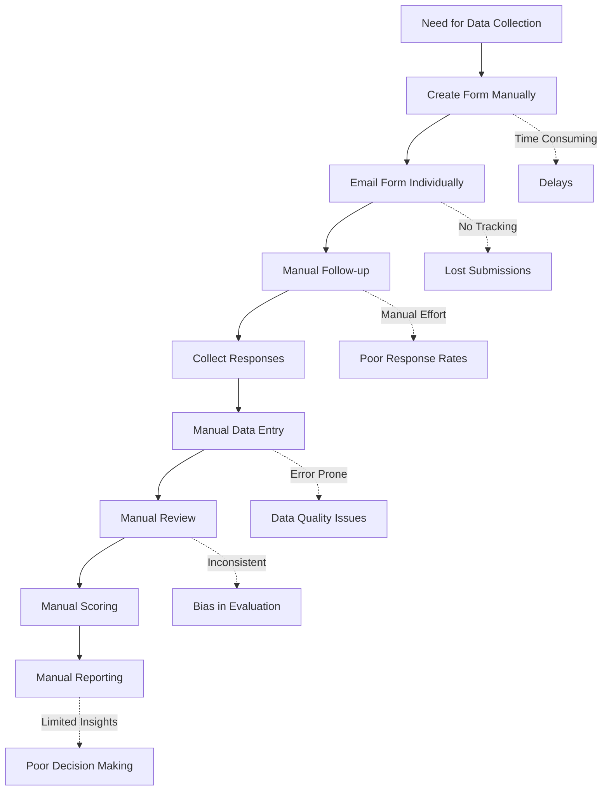
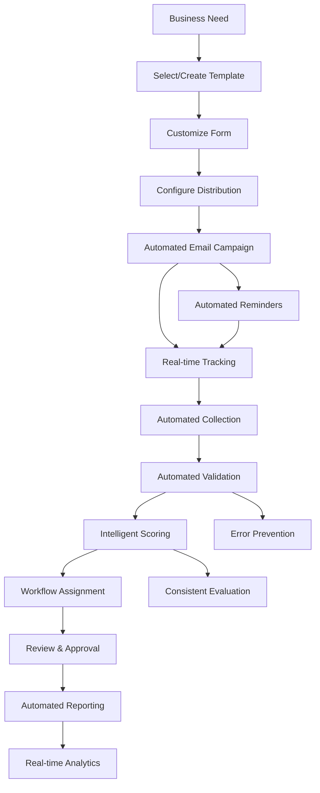
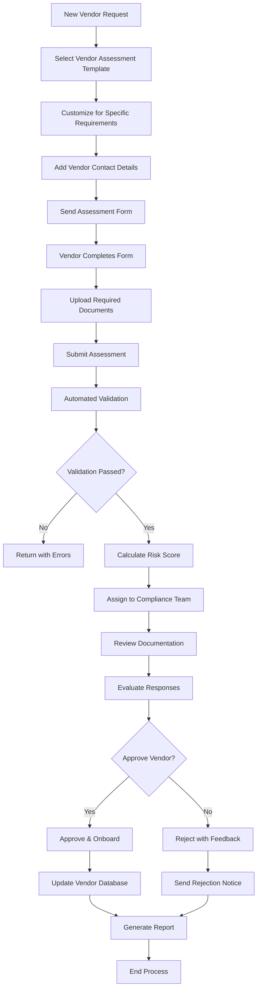
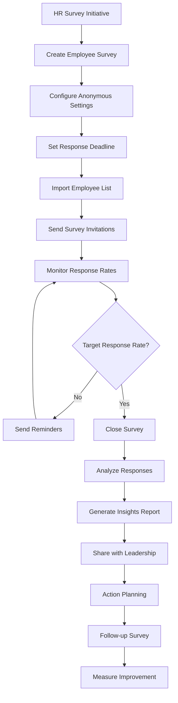

# Business Requirements Document (BRD)
## Form Builder & Submission Management System

### Version: 1.0
### Date: July 2025

---

## Table of Contents
1. [Executive Summary](#executive-summary)
2. [Business Objectives](#business-objectives)
3. [Business Requirements](#business-requirements)
4. [Stakeholder Analysis](#stakeholder-analysis)
5. [Business Process Flows](#business-process-flows)
6. [Success Criteria](#success-criteria)
7. [Risk Assessment](#risk-assessment)
8. [Implementation Timeline](#implementation-timeline)
9. [Cost-Benefit Analysis](#cost-benefit-analysis)

---

## 1. Executive Summary

### 1.1 Project Overview
The Form Builder & Submission Management System is a comprehensive digital solution designed to streamline the creation, distribution, and management of forms across organizations. The system addresses the critical business need for efficient data collection, automated workflows, and intelligent submission processing.

### 1.2 Business Problem Statement
Organizations currently face significant challenges in:
- **Manual Form Management**: Time-consuming paper-based or basic digital forms
- **Inefficient Distribution**: Manual email distribution without tracking
- **Disorganized Data Collection**: Scattered submissions across multiple platforms
- **Lack of Analytics**: No insights into form performance or completion rates
- **Manual Review Processes**: Time-intensive manual evaluation of submissions
- **Limited Reporting**: Difficulty in generating comprehensive reports

### 1.3 Proposed Solution
A unified platform that provides:
- **Visual Form Builder**: Drag-and-drop interface for rapid form creation
- **Automated Distribution**: Email campaigns with tracking and reminders
- **Intelligent Processing**: Automated validation and scoring mechanisms
- **Comprehensive Analytics**: Real-time dashboards and detailed reporting
- **Workflow Management**: Streamlined review and approval processes

### 1.4 Expected Business Impact
- **75% reduction** in form creation time through 169 industry-specific templates and advanced filtering
- **80% improvement** in response rates through AI-optimized email campaigns and automated reminders  
- **70% faster** submission processing through AI-powered review recommendations and automated scoring
- **85% reduction** in manual data entry errors through real-time validation and smart categorization
- **100% visibility** into form performance through comprehensive analytics with sector-specific insights
- **Enhanced decision quality** through AI approval recommendations and standardized approval types
- **Improved compliance** through automated audit trails and granular approval tracking (Fully vs Partially Approved)
- **Streamlined workflows** through multi-sector template library with instant filtering and categorization

---

## 2. Business Objectives

### 2.1 Primary Objectives

#### 2.1.1 Operational Efficiency
**Objective**: Reduce form-related administrative overhead by 60%
- Automate form creation and distribution processes
- Eliminate manual data entry and processing
- Streamline review and approval workflows
- Reduce time from form creation to data collection

#### 2.1.2 Data Quality Improvement
**Objective**: Achieve 95% data accuracy in collected submissions
- Implement real-time validation rules
- Enforce required field completion
- Standardize data collection formats
- Reduce human error in data entry

#### 2.1.3 Response Rate Optimization
**Objective**: Increase form completion rates by 40%
- Provide mobile-responsive form interfaces
- Implement automated reminder systems
- Offer progress tracking for long forms
- Optimize user experience for higher engagement

#### 2.1.4 Compliance and Audit Trail
**Objective**: Ensure 100% compliance with regulatory requirements
- Maintain complete audit trails for all activities
- Implement role-based access controls
- Ensure data security and privacy compliance
- Provide comprehensive reporting for audits

### 2.2 Secondary Objectives

#### 2.2.1 Scalability
- Support growing organization needs
- Handle increasing form volumes
- Accommodate additional user bases
- Integrate with existing enterprise systems

#### 2.2.2 User Adoption
- Achieve 90% user adoption within 6 months
- Provide intuitive user interfaces
- Minimize training requirements
- Offer comprehensive support resources

---

## 3. Business Requirements

### 3.1 Form Creation and Management

#### BR-001: Dynamic Form Builder
**Business Need**: Enable non-technical users to create professional forms quickly
**Requirements**:
- Visual drag-and-drop interface
- Support for 15+ field types (text, number, date, file upload, etc.)
- Conditional logic for dynamic field display
- Form preview and testing capabilities
- Template library for common use cases

**Business Value**: Reduces dependency on IT department, accelerates form deployment

#### BR-002: Comprehensive Template Management
**Business Need**: Provide industry-specific templates with intelligent categorization
**Requirements**:
- 169 pre-built templates across 8 major sectors (Government, Insurance, Fintech, Healthcare, Energy, Telecom, Startups, SME)
- Advanced multi-select filtering with real-time counts and smart categorization
- Templates tagged with "Multi-Sector", "Multi-Category", or "Other" classifications
- Instant search and filtering capabilities with sector-specific icons and descriptions
- Template customization with inheritance from sector-specific base configurations
- Version control and template analytics for usage tracking

**Business Value**: 75% faster form creation, industry expertise built-in, reduced compliance risk, standardized best practices

### 3.2 Distribution and Communication

#### BR-003: Email Campaign Management
**Business Need**: Efficiently distribute forms to target audiences
**Requirements**:
- Bulk email distribution with personalization
- Automated reminder scheduling
- Email delivery tracking and analytics
- Customizable email templates
- Unique access links for security

**Business Value**: Improves response rates, reduces manual follow-up effort

#### BR-004: Recipient Management
**Business Need**: Organize and track form recipients effectively
**Requirements**:
- Contact list management with import/export
- Recipient grouping and segmentation
- Status tracking (sent, opened, completed)
- Automated reminder workflows
- Expiration date management

**Business Value**: Better organization, improved tracking, higher completion rates

### 3.3 Data Collection and Processing

#### BR-005: Intelligent Form Processing
**Business Need**: Automate data validation and initial processing
**Requirements**:
- Real-time field validation
- Automatic data type conversion
- File upload with virus scanning
- Progress saving for long forms
- Mobile-responsive design

**Business Value**: Reduces errors, improves user experience, ensures data quality

#### BR-006: Submission Management
**Business Need**: Organize and track all form submissions centrally
**Requirements**:
- Centralized submission dashboard
- Advanced search and filtering
- Bulk operations (approve, reject, export)
- Status tracking throughout lifecycle
- Document attachment management

**Business Value**: Centralized control, improved efficiency, better tracking

### 3.4 Review and Scoring

#### BR-007: AI-Enhanced Scoring System
**Business Need**: Standardize evaluation processes with intelligent recommendations
**Requirements**:
- Configurable scoring criteria and weights across multiple risk categories
- AI-powered analysis of submission data for approval recommendations
- Automated calculation of total scores with risk level assignment
- Machine learning-based suggestions for approval types (Fully/Partially Approved)
- Manual override capabilities with audit trail of AI vs human decisions
- Real-time score breakdown and predictive analytics

**Business Value**: Consistency in evaluation, 70% faster processing, reduced bias, intelligent decision support

#### BR-008: AI-Enhanced Review Workflow Management
**Business Need**: Streamline approval processes with intelligent decision support
**Requirements**:
- Multi-level approval workflows with AI-powered decision recommendations
- **Fully Approved**: Complete implementation without conditions (AI confidence > 85%)
- **Partially Approved**: Conditional implementation with AI-suggested limitations
- Machine learning-based approval suggestions analyzing scoring patterns, risk factors, and historical decisions
- Automatic assignment to reviewers based on expertise and workload
- Intelligent review queue prioritization using risk scores and AI recommendations
- Approval/rejection with AI-generated insights, detailed comments, and approval type justification
- Escalation automation for overdue reviews with AI priority scoring
- Comprehensive analytics tracking AI accuracy, approval type distribution, and decision patterns
- Real-time dashboard showing AI vs human decision alignment and system learning progress

**Business Value**: 60% faster turnaround, consistent decision quality, predictive risk assessment, continuous improvement through AI learning

### 3.5 Analytics and Reporting

#### BR-009: Real-time Analytics Dashboard
**Business Need**: Monitor form performance and user engagement
**Requirements**:
- Real-time metrics and KPIs
- Completion rate tracking
- Response time analytics
- Email campaign performance
- User engagement metrics

**Business Value**: Data-driven insights, performance optimization, trend identification

#### BR-010: Comprehensive Reporting
**Business Need**: Generate detailed reports for stakeholders and compliance
**Requirements**:
- Pre-built report templates (executive summary, risk analysis, etc.)
- Custom report builder
- Multiple export formats (PDF, Excel, CSV)
- Scheduled report generation
- Visual charts and graphs

**Business Value**: Better decision-making, compliance reporting, stakeholder communication

### 3.6 Security and Compliance

#### BR-011: Data Security
**Business Need**: Protect sensitive information and maintain privacy
**Requirements**:
- Role-based access control
- Data encryption at rest and in transit
- Audit trail for all activities
- Secure file storage
- GDPR/CCPA compliance features

**Business Value**: Risk mitigation, regulatory compliance, trust building

---

## 4. Stakeholder Analysis

### 4.1 Primary Stakeholders

#### 4.1.1 Form Creators (Department Managers, HR, Compliance Officers)
**Interests**: Easy form creation, efficient distribution, comprehensive analytics
**Influence**: High - Primary users who drive adoption
**Requirements**:
- Intuitive form builder interface
- Template library for quick setup
- Detailed analytics and reporting
- Email distribution capabilities

#### 4.1.2 Reviewers/Evaluators (Managers, Compliance Teams)
**Interests**: Efficient review process, consistent scoring, clear workflows
**Influence**: High - Critical for approval processes
**Requirements**:
- Clear review interface
- Automated scoring assistance
- Workflow management
- Bulk operations capabilities

#### 4.1.3 System Administrators (IT Department)
**Interests**: System reliability, security, integration capabilities
**Influence**: High - Responsible for system maintenance
**Requirements**:
- Robust security features
- Integration capabilities
- Performance monitoring
- User management tools

### 4.2 Secondary Stakeholders

#### 4.2.1 Executive Leadership
**Interests**: ROI, operational efficiency, compliance
**Influence**: High - Decision makers for budget and strategy
**Requirements**:
- Executive dashboards
- Cost savings metrics
- Compliance reporting
- Strategic analytics

#### 4.2.2 Form Recipients (External Partners, Vendors, Customers)
**Interests**: Easy form completion, clear instructions, mobile accessibility
**Influence**: Medium - Affects adoption success
**Requirements**:
- User-friendly interface
- Mobile responsiveness
- Clear instructions
- Progress saving

#### 4.2.3 Legal/Compliance Teams
**Interests**: Regulatory compliance, audit trails, data protection
**Influence**: Medium - Gatekeepers for compliance
**Requirements**:
- Audit trail capabilities
- Data retention policies
- Privacy compliance features
- Security controls

---

## 5. Business Process Flows

### 5.1 Current State Process (Problems)

### 5.2 Future State Process (Solution)

### 5.3 Vendor Onboarding Process Example

### 5.4 Employee Survey Process Example

---

## 6. Success Criteria

### 6.1 Quantitative Metrics

#### 6.1.1 Operational Efficiency
- **Form Creation Time**: Reduce from 4 hours to 1.5 hours (62% improvement)
- **Processing Time**: Reduce submission processing from 3 days to 1 day (67% improvement)
- **Manual Effort**: Reduce administrative time by 50%
- **Error Rates**: Decrease data entry errors by 80%

#### 6.1.2 User Adoption
- **User Adoption Rate**: 90% of eligible users within 6 months
- **Form Completion Rate**: Increase from 45% to 70%
- **User Satisfaction**: Achieve 8.5/10 satisfaction score
- **Training Time**: Reduce from 8 hours to 2 hours

#### 6.1.3 Business Impact
- **Cost Savings**: Achieve $150K annual savings in administrative costs
- **Revenue Impact**: Enable $500K in new business through faster processing
- **Compliance Score**: Maintain 100% audit compliance
- **Response Times**: Improve customer response time by 60%

### 6.2 Qualitative Metrics

#### 6.2.1 User Experience
- Intuitive interface requiring minimal training
- Positive feedback from both creators and recipients
- Seamless mobile experience
- Clear and helpful error messages

#### 6.2.2 Business Value
- Improved decision-making through better data
- Enhanced compliance and risk management
- Stronger vendor/partner relationships
- Better internal communication and feedback

---

## 7. Risk Assessment

### 7.1 High-Risk Items

#### Risk-001: User Adoption Resistance
**Probability**: Medium | **Impact**: High
**Description**: Users may resist changing from current processes
**Mitigation**:
- Comprehensive change management program
- Early user involvement in design
- Phased rollout with success showcases
- Executive sponsorship and communication

#### Risk-002: Data Migration Complexity
**Probability**: Medium | **Impact**: High
**Description**: Existing data may be difficult to migrate
**Mitigation**:
- Early data assessment and cleanup
- Parallel system operation during transition
- Professional data migration services
- Comprehensive backup and recovery plans

#### Risk-003: Integration Challenges
**Probability**: Low | **Impact**: Medium
**Description**: Integration with existing systems may face technical issues
**Mitigation**:
- Early technical assessment
- Proof-of-concept development
- API-first architecture
- Professional integration services

### 7.2 Medium-Risk Items

#### Risk-004: Performance Issues
**Probability**: Low | **Impact**: Medium
**Description**: System may not handle expected load
**Mitigation**:
- Load testing during development
- Cloud-based scalable architecture
- Performance monitoring tools
- Capacity planning

#### Risk-005: Security Vulnerabilities
**Probability**: Low | **Impact**: High
**Description**: Security breaches could compromise sensitive data
**Mitigation**:
- Security-first development approach
- Regular security audits and testing
- Compliance with security standards
- Staff security training

---

## 8. Implementation Timeline

### 8.1 Phase 1: Foundation (Months 1-3)
**Objectives**: Establish core infrastructure and basic functionality
- Database design and setup
- User authentication and authorization
- Basic form builder interface
- Email integration setup

**Deliverables**:
- Working form builder prototype
- User management system
- Basic email distribution
- Initial testing environment

### 8.2 Phase 2: Core Features (Months 4-6)
**Objectives**: Implement primary business functionality
- Advanced form builder features
- Submission management system
- Review and scoring workflows
- Basic reporting capabilities

**Deliverables**:
- Complete form creation and distribution
- Submission collection and processing
- Review workflow implementation
- Basic analytics dashboard

### 8.3 Phase 3: Advanced Features (Months 7-9)
**Objectives**: Add sophisticated features and optimizations
- Advanced analytics and reporting
- Template management system
- Automated scoring and risk assessment
- Mobile optimization

**Deliverables**:
- Comprehensive reporting suite
- Template library
- Advanced scoring algorithms
- Mobile-responsive interface

### 8.4 Phase 4: Optimization and Launch (Months 10-12)
**Objectives**: Optimize performance and prepare for full deployment
- Performance optimization
- Security hardening
- User training and documentation
- Full production deployment

**Deliverables**:
- Production-ready system
- User training materials
- Support documentation
- Go-live support

---

## 9. Cost-Benefit Analysis

### 9.1 Implementation Costs

#### 9.1.1 Development Costs
- **Software Development**: $200,000
- **Database and Infrastructure**: $50,000
- **Third-party Integrations**: $30,000
- **Security and Compliance**: $40,000
- **Testing and QA**: $35,000

**Total Development**: $355,000

#### 9.1.2 Operational Costs (Annual)
- **Cloud Hosting**: $12,000
- **Email Service**: $6,000
- **Storage**: $3,600
- **Maintenance and Support**: $25,000
- **Training and Change Management**: $15,000

**Total Annual Operating**: $61,600

### 9.2 Projected Benefits

#### 9.2.1 Direct Cost Savings (Annual)
- **Administrative Time Reduction**: $180,000
- **Paper and Printing Elimination**: $15,000
- **Reduced Error Correction**: $25,000
- **Compliance Efficiency**: $20,000

**Total Direct Savings**: $240,000

#### 9.2.2 Indirect Benefits (Annual Value)
- **Faster Decision Making**: $100,000
- **Improved Compliance**: $50,000
- **Better Customer Experience**: $75,000
- **Data-Driven Insights**: $60,000

**Total Indirect Benefits**: $285,000

### 9.3 ROI Calculation

**Year 1**:
- Total Investment: $355,000 + $61,600 = $416,600
- Total Benefits: $240,000 + $285,000 = $525,000
- **Net Benefit**: $108,400
- **ROI**: 26%

**Year 2-3** (Annual):
- Annual Costs: $61,600
- Annual Benefits: $525,000
- **Annual Net Benefit**: $463,400
- **3-Year Total ROI**: 380%

### 9.4 Break-Even Analysis
The system will break even in approximately 9.5 months, making it a highly attractive investment with significant long-term value.

---

## 10. Assumptions and Dependencies

### 10.1 Key Assumptions
- Organization has reliable internet connectivity
- Users have access to modern web browsers
- Email infrastructure is available and functional
- Management commitment to change management
- Existing data can be migrated or recreated

### 10.2 Critical Dependencies
- Executive sponsorship and budget approval
- IT infrastructure readiness
- User availability for training and testing
- Integration with existing email systems
- Compliance and security approval processes

---

## 11. Next Steps and Recommendations

### 11.1 Immediate Actions (Next 30 Days)
1. **Stakeholder Approval**: Secure formal approval from executive leadership
2. **Project Team Formation**: Assemble project team with clear roles
3. **Vendor Selection**: If outsourcing, begin vendor evaluation process
4. **Requirements Validation**: Conduct detailed requirements workshops
5. **Infrastructure Assessment**: Evaluate current IT infrastructure readiness

### 11.2 Short-term Actions (Next 90 Days)
1. **Detailed Project Planning**: Create comprehensive project plan
2. **Change Management Strategy**: Develop user adoption strategy
3. **Security Assessment**: Conduct security and compliance review
4. **Prototype Development**: Begin development of core functionality
5. **User Involvement**: Establish user advisory group

### 11.3 Success Factors
- **Executive Sponsorship**: Strong leadership support throughout implementation
- **User Engagement**: Active involvement of end users in design and testing
- **Change Management**: Comprehensive training and support programs
- **Quality Assurance**: Rigorous testing and validation processes
- **Continuous Improvement**: Regular feedback collection and system optimization

---

*This Business Requirements Document provides the foundation for successful implementation of the Form Builder & Submission Management System. Regular review and updates of these requirements will ensure the project remains aligned with business objectives and delivers maximum value to the organization.*