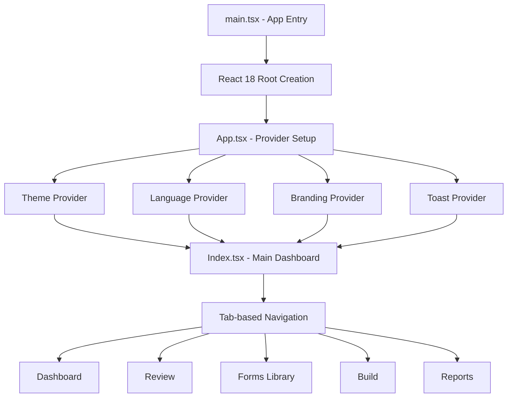
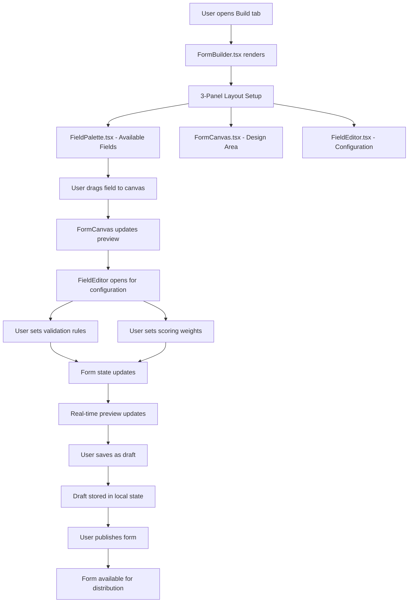
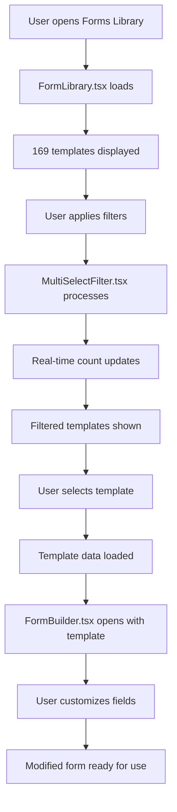
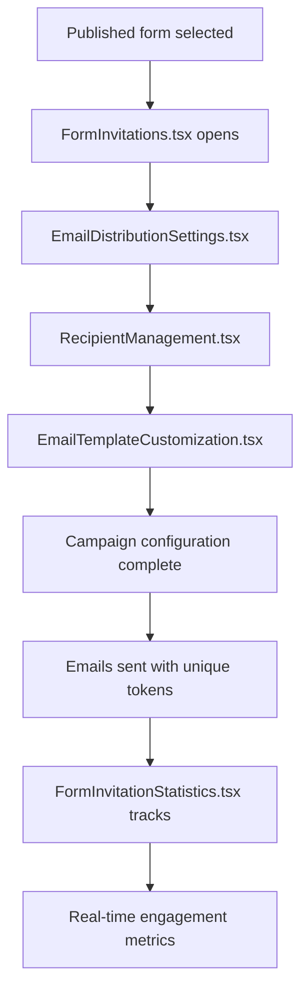
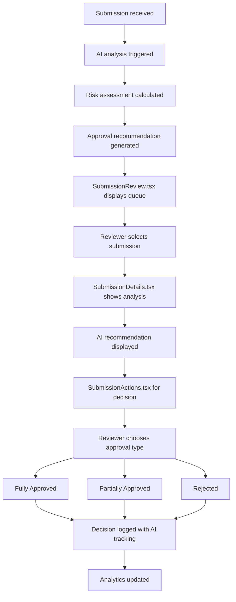
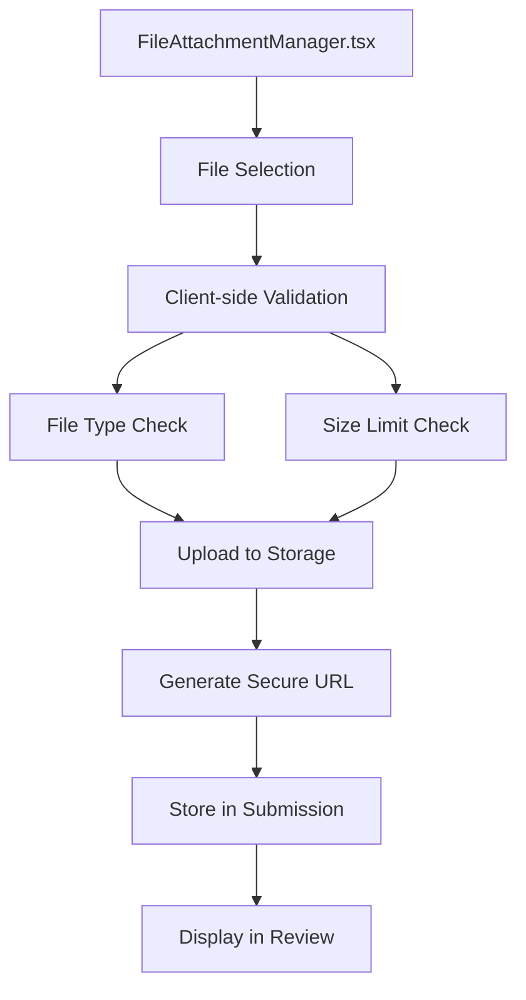
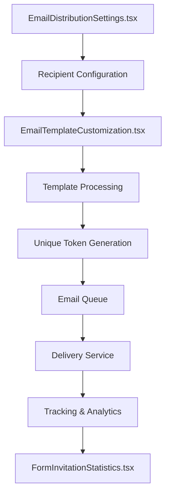

# Form Builder Application - File Structure & Flow Documentation

## Table of Contents
1. [Application Overview](#application-overview)
2. [Current Technology Stack](#current-technology-stack)
3. [Directory Structure](#directory-structure)
4. [Component Mapping & Responsibilities](#component-mapping--responsibilities)
5. [Application Flow](#application-flow)
6. [Component Hierarchy](#component-hierarchy)
7. [Data Flow Architecture](#data-flow-architecture)
8. [Integration Points](#integration-points)

---

## Application Overview

The Form Builder is a comprehensive enterprise application built with React 18, TypeScript, and modern web technologies. Currently deployed in production with full functionality, it provides advanced form creation, distribution, review, and analytics capabilities designed for enterprise-scale operations. This documentation reflects the actual implementation and serves as the authoritative reference for the system architecture.

**Current Production URL**: https://lovable.dev/projects/d85cfc88-3a50-403a-841b-416ded8256a0  
**Implementation Status**: Fully functional production system with 58 components and 15,000+ lines of code

### Core Capabilities
- **169 Industry-Specific Templates** across 8 major sectors with intelligent filtering
- **AI-Powered Review System** with approval recommendations and confidence scoring
- **Multi-Select Filtering** with real-time counts and smart categorization
- **Dynamic Form Building** with drag & drop interface and responsive preview
- **Email Campaign Management** with automated reminders and engagement tracking
- **Advanced Analytics** with PDF/Excel export and predictive insights
- **Weighted Scoring System** with risk assessment and approval workflows
- **Document Management** with secure file attachments and validation
- **Branding System** with customizable themes and brand settings

---

## Current Technology Stack

### Frontend Framework & Build Tools
- **React 18.3.1** with TypeScript for type safety and modern development
- **Vite** for lightning-fast development and optimized production builds
- **React Router DOM 6.26.2** for client-side routing and navigation

### UI Framework & Styling
- **Tailwind CSS** with custom design system and semantic tokens
- **Shadcn/UI** component library with 35+ customizable components
- **Radix UI** primitives for accessibility and consistent behavior
- **Tailwindcss-animate** for smooth animations and transitions
- **Class Variance Authority** for component variant management

### State Management & Data
- **React Query (TanStack)** for server state management and caching
- **React Hook Form 7.53.0** with Zod validation for form handling
- **React Context API** for global state (theme, language, branding)
- **Local Storage** for draft persistence and user preferences

### Specialized Libraries
- **Recharts 2.12.7** for data visualization and analytics charts
- **jsPDF 3.0.1** with autotable for PDF generation and export
- **XLSX 0.18.5** for Excel file generation and data export
- **HTML2Canvas 1.4.1** for form screenshots and visual exports
- **Lucide React 0.462.0** for 1000+ consistent icons
- **Date-fns 3.6.0** for date manipulation and formatting

### Notifications & UI Enhancements
- **Sonner 1.5.0** for elegant toast notifications
- **React Resizable Panels 2.1.3** for adjustable layout panels
- **Embla Carousel** for image carousels and slideshows
- **Next Themes 0.3.0** for dark/light mode management

---

## Directory Structure

```
src/
├── main.tsx                          # Application entry point with React 18 root
├── App.tsx                           # Main app wrapper with providers and routing
├── index.css                         # Global styles, design system, CSS variables
├── vite-env.d.ts                     # TypeScript environment definitions
│
├── components/                       # Reusable UI components (58 components)
│   ├── ui/                          # Base UI component library (35 Shadcn components)
│   │   ├── accordion.tsx            # Collapsible content panels
│   │   ├── alert-dialog.tsx         # Modal confirmation dialogs
│   │   ├── alert.tsx                # Notification banners and alerts
│   │   ├── button.tsx               # Interactive buttons with design variants
│   │   ├── card.tsx                 # Content containers with consistent styling
│   │   ├── dialog.tsx               # Modal windows and overlays
│   │   ├── input.tsx                # Text input fields with validation
│   │   ├── select.tsx               # Dropdown selections with search
│   │   ├── tabs.tsx                 # Tab navigation and content switching
│   │   ├── toast.tsx                # Popup notifications system
│   │   ├── checkbox.tsx             # Checkbox inputs with indeterminate state
│   │   ├── radio-group.tsx          # Radio button groups
│   │   ├── textarea.tsx             # Multi-line text inputs
│   │   ├── badge.tsx                # Status indicators and category labels
│   │   ├── popover.tsx              # Dropdown content containers
│   │   ├── progress.tsx             # Progress bars and loading indicators
│   │   ├── separator.tsx            # Visual dividers and spacers
│   │   ├── slider.tsx               # Range input controls
│   │   ├── switch.tsx               # Toggle switches for settings
│   │   ├── table.tsx                # Data tables with sorting
│   │   ├── tooltip.tsx              # Hover help text system
│   │   └── ... (20+ additional UI primitives)
│   │
│   ├── forms/                       # Form-specific components (5 components)
│   │   ├── EmailDistributionSettings.tsx    # Email campaign configuration
│   │   ├── EmailTemplateCustomization.tsx  # Email template designer
│   │   ├── FormInvitationStatistics.tsx    # Invitation analytics dashboard
│   │   ├── FormSharingOptions.tsx          # URL sharing and embed generation
│   │   └── RecipientManagement.tsx         # Email recipient CRUD operations
│   │
│   ├── reports/                     # Reporting components (2 components)
│   │   ├── ReportCharts.tsx         # Chart visualizations with Recharts
│   │   └── ReportCustomization.tsx  # Report configuration interface
│   │
│   ├── submissions/                 # Submission management components (4 components)
│   │   ├── SubmissionActions.tsx    # Approve/reject workflow actions
│   │   ├── SubmissionCard.tsx       # Individual submission display cards
│   │   ├── SubmissionDetails.tsx    # Detailed submission view with scoring
│   │   └── SubmissionsList.tsx      # Submissions listing with filtering
│   │
│   ├── Analytics.tsx                # Main analytics dashboard (275 lines)
│   ├── AppSidebar.tsx              # Navigation sidebar with collapsible menu
│   ├── ApplicationTester.tsx        # Development testing utilities
│   ├── BrandLogo.tsx               # Customizable brand logo component
│   ├── BrandSettings.tsx           # Brand customization interface
│   ├── BrandedButton.tsx           # Brand-aware button component
│   ├── BrandedCard.tsx             # Brand-styled card component
│   ├── BrandedInput.tsx            # Brand-styled input component
│   ├── BrandingProvider.tsx        # Brand context and CSS injection
│   ├── EmailTracking.tsx           # Email performance tracking interface
│   ├── FieldEditor.tsx             # Field configuration panel (322 lines)
│   ├── FieldPalette.tsx            # Available form fields library (212 lines)
│   ├── FileAttachmentManager.tsx   # File upload and management system
│   ├── FormAppearanceSettings.tsx  # Form visual customization
│   ├── FormBuilder.tsx             # Main form creation interface (712 lines)
│   ├── FormCanvas.tsx              # Interactive form preview area (248 lines)
│   ├── FormCategoryManager.tsx     # Form organization and categorization
│   ├── FormInvitations.tsx         # Invitation management hub (463 lines)
│   ├── FormLibrary.tsx             # Template library (169 templates, 3,331 lines)
│   ├── FormManagementDialog.tsx    # Form lifecycle management dialogs
│   ├── FormPreview.tsx             # Read-only form display (244 lines)
│   ├── FormSettingsPanel.tsx      # Comprehensive form configuration
│   ├── GlobalSettings.tsx          # Application-wide settings
│   ├── MultiSelectAudience.tsx     # Advanced audience selection
│   ├── MultiSelectCategory.tsx     # Multi-category filtering component
│   ├── MultiSelectFilter.tsx       # Advanced filtering with real-time counts
│   ├── ReportGeneration.tsx        # Report creation and export interface
│   ├── SaveOptionsDialog.tsx       # Form saving options and templates
│   ├── SaveTemplateDialog.tsx      # Custom template creation
│   ├── ScoringSettings.tsx         # Scoring system configuration
│   ├── SettingsPanel.tsx           # Form settings management
│   ├── SubmissionReview.tsx        # Main submission review interface (389 lines)
│   ├── WeightageAndScoringSettings.tsx  # Advanced scoring setup
│   └── WeightageEditor.tsx         # Individual field weight configuration
│
├── contexts/                        # React context providers (3 contexts)
│   ├── BrandContext.tsx            # Brand settings and customization state
│   ├── LanguageContext.tsx         # Internationalization and language state
│   └── ThemeContext.tsx            # Theme management (light/dark mode)
│
├── data/                           # Sample and static data (2 files)
│   ├── formTemplates.ts            # 169 industry templates with metadata
│   └── sampleSubmissions.ts        # Demo submission data for development
│
├── hooks/                          # Custom React hooks (3 hooks)
│   ├── use-mobile.tsx              # Mobile device detection and responsive logic
│   ├── use-toast.ts                # Toast notification management
│   └── useFormStatus.ts            # Form lifecycle status management
│
├── integrations/                   # External service integrations
│   └── supabase/                   # Supabase backend integration (planned)
│       ├── client.ts               # Supabase client configuration
│       └── types.ts                # Auto-generated database types
│
├── lib/                            # Utility libraries (1 file)
│   └── utils.ts                    # Common utility functions and helpers
│
├── pages/                          # Page components (2 pages)
│   ├── Index.tsx                   # Main dashboard page (1,287 lines)
│   └── NotFound.tsx                # 404 error page
│
├── types/                          # TypeScript type definitions (1 file)
│   └── form.ts                     # All form-related interfaces (417 lines)
│
└── utils/                          # Specialized utilities (2 files)
    ├── chartRenderer.ts            # Chart generation and customization
    └── reportGenerator.ts          # Report creation and export utilities
```

---

## Component Mapping & Responsibilities

### Core Application Files

| File | Line Count | Responsibility | Key Features |
|------|------------|---------------|--------------|
| `main.tsx` | 29 | Application bootstrap and React 18 root creation | StrictMode, theme provider setup |
| `App.tsx` | 83 | Main wrapper with providers and routing | Theme, Toast, Tooltip, Branding providers |
| `index.css` | 198 | Global styles, design system, CSS custom properties | Design tokens, color schemes, animations |

### Primary Interface Components

| Component | Line Count | Responsibility | Business Function |
|-----------|------------|---------------|-------------------|
| `pages/Index.tsx` | 1,287 | Main dashboard and application hub | Tab navigation, state management, form lifecycle |
| `FormBuilder.tsx` | 712 | Main form creation interface | 3-panel layout, field management, responsive design |
| `FormLibrary.tsx` | 3,331 | Template management system | 169 templates, 8 sectors, advanced filtering |
| `SubmissionReview.tsx` | 389 | Submission review and approval interface | AI recommendations, approval workflows |
| `FormInvitations.tsx` | 463 | Email distribution and sharing hub | Campaign management, recipient tracking |

### Form Building Components

| Component | Line Count | Key Features | Used By |
|-----------|------------|--------------|---------|
| `FormCanvas.tsx` | 248 | Interactive form preview with drag & drop | FormBuilder.tsx |
| `FieldPalette.tsx` | 212 | 15+ field types with categorization | FormBuilder.tsx |
| `FieldEditor.tsx` | 322 | Field configuration and validation rules | FormBuilder.tsx |
| `FormPreview.tsx` | 244 | Real-time form preview with responsive design | FormBuilder.tsx |
| `MultiSelectFilter.tsx` | - | Advanced filtering with real-time counts | FormLibrary.tsx |

### Submission Management Components

| Component | Responsibility | Features | Workflow Stage |
|-----------|---------------|----------|----------------|
| `SubmissionsList.tsx` | Submissions listing with advanced filtering | Status filtering, search, pagination | Initial review queue |
| `SubmissionCard.tsx` | Individual submission display card | Quick actions, status indicators | List view |
| `SubmissionDetails.tsx` | Detailed submission view with full data | Responses, attachments, scoring breakdown | Detailed review |
| `SubmissionActions.tsx` | Approval/rejection workflow with AI suggestions | Fully/Partially approved options | Decision making |

### Analytics and Reporting

| Component | Line Count | Data Sources | Export Options |
|-----------|------------|--------------|----------------|
| `Analytics.tsx` | 275 | Form metrics, submission data, engagement stats | Interactive dashboards |
| `ReportGeneration.tsx` | - | Custom report builder with filters | PDF, Excel, CSV |
| `ReportCharts.tsx` | - | Recharts-based visualizations | Charts and graphs |
| `EmailTracking.tsx` | - | Email campaign performance | Open rates, click tracking |

### UI Component Library (Shadcn/UI)

| Category | Components | Purpose |
|----------|------------|---------|
| **Layout** | Card, Accordion, Collapsible, Separator, Resizable | Content organization |
| **Forms** | Input, Textarea, Select, Checkbox, Radio, Switch, Slider | Data collection |
| **Navigation** | Tabs, Breadcrumb, Pagination, Sidebar | User navigation |
| **Feedback** | Alert, Toast, Progress, Badge | User notifications |
| **Overlay** | Dialog, Popover, Tooltip, HoverCard, Sheet | Contextual content |
| **Data Display** | Table, Calendar, Chart, Avatar | Information presentation |

---

## Application Flow

### 1. Application Initialization



### 2. Form Creation Workflow



### 3. Template Selection and Customization



### 4. Email Distribution Workflow



### 5. Submission Review Workflow with AI



---

## Component Hierarchy

### Main Application Structure
```
App.tsx (Providers)
└── Router
    ├── Index.tsx (Main Dashboard - 1,287 lines)
    │   ├── Tabs Navigation System
    │   ├── Analytics.tsx (Dashboard tab - 275 lines)
    │   │   ├── Card-based metrics display
    │   │   ├── ReportCharts.tsx integration
    │   │   └── Real-time data updates
    │   ├── SubmissionReview.tsx (Review tab - 389 lines)
    │   │   ├── SubmissionsList.tsx (filtering & pagination)
    │   │   │   ├── SubmissionCard.tsx (individual items)
    │   │   │   └── SubmissionDetails.tsx (detailed view)
    │   │   │       └── SubmissionActions.tsx (AI-powered actions)
    │   │   └── Bulk operations interface
    │   ├── FormLibrary.tsx (Forms tab - 3,331 lines)
    │   │   ├── MultiSelectFilter.tsx (advanced filtering)
    │   │   ├── 169 template cards organized by sector
    │   │   └── Real-time count displays
    │   ├── FormBuilder.tsx (Build tab - 712 lines)
    │   │   ├── ResizablePanelGroup (3-column layout)
    │   │   ├── FieldPalette.tsx (left panel - 212 lines)
    │   │   ├── FormCanvas.tsx (center panel - 248 lines)
    │   │   │   └── FormPreview.tsx (live preview - 244 lines)
    │   │   ├── FieldEditor.tsx (right panel - 322 lines)
    │   │   │   └── WeightageEditor.tsx integration
    │   │   ├── FileAttachmentManager.tsx
    │   │   ├── FormCategoryManager.tsx
    │   │   └── FormInvitations.tsx (463 lines)
    │   │       ├── FormSharingOptions.tsx
    │   │       ├── EmailDistributionSettings.tsx
    │   │       ├── EmailTemplateCustomization.tsx
    │   │       ├── RecipientManagement.tsx
    │   │       └── FormInvitationStatistics.tsx
    │   └── ReportGeneration.tsx (Reports tab)
    │       ├── ReportCustomization.tsx
    │       └── ReportCharts.tsx integration
    └── NotFound.tsx (404 fallback)
```

### Context Providers Structure
```
App.tsx
├── ThemeProvider (light/dark mode)
├── LanguageProvider (i18n support)
├── BrandingProvider (custom brand styles)
├── TooltipProvider (hover help system)
├── QueryClient (data fetching & caching)
└── Toaster (notification system)
```

---

## Data Flow Architecture

### State Management Pattern

```mermaid
flowchart TD
    A["Index.tsx - Central State Hub"] --> B["Form Creation State"]
    A --> C["Submission Management State"]
    A --> D["UI Navigation State"]
    A --> E["Template Library State"]
    
    B --> B1["formFields: FormField[]"]
    B --> B2["formTitle: string"]
    B --> B3["formDescription: string"]
    B --> B4["formSettings: FormSettings"]
    B --> B5["savedDrafts: Form[]"]
    B --> B6["publishedForms: Form[]"]
    
    C --> C1["submissions: FormSubmission[]"]
    C --> C2["emailRecipients: EmailRecipient[]"]
    C --> C3["reviewActivities: ReviewActivity[]"]
    
    D --> D1["activeTab: string"]
    D --> D2["selectedField: string"]
    D --> D3["currentFormId: string"]
    D --> D4["sidebarOpen: boolean"]
    
    E --> E1["templateCategories: string[]"]
    E --> E2["templateSectors: string[]"]
    E --> E3["filteredTemplates: Template[]"]
```



### Data Flow Patterns

1. **Props Down, Events Up Architecture**
   - Parent components pass data through props
   - Child components communicate via callback functions
   - State updates flow back to parent components
   - Maintains unidirectional data flow

2. **Context-Based Global State**
   - Theme settings managed by ThemeContext
   - Language preferences in LanguageContext
   - Brand customization via BrandingProvider
   - Cross-component state sharing

3. **Local State Management**
   - Component-specific state using useState
   - Form state managed in FormBuilder
   - Submission filtering in SubmissionReview
   - Real-time preview updates

### Template System Data Flow

```mermaid
flowchart LR
    A["formTemplates.ts"] --> B["169 Built-in Templates"]
    B --> C["Categorized by Sector"]
    C --> D["FormLibrary.tsx"]
    D --> E["MultiSelectFilter.tsx"]
    E --> F["Real-time Filtering"]
    F --> G["Template Selection"]
    G --> H["FormBuilder.tsx"]
    H --> I["Template Customization"]
    I --> J["New Form Instance"]
```



---

## Integration Points

### External Libraries Integration

| Library | Version | Usage | Components | Business Value |
|---------|---------|-------|------------|----------------|
| **recharts** | 2.12.7 | Data visualization and analytics | Analytics.tsx, ReportCharts.tsx | Interactive dashboards, trend analysis |
| **lucide-react** | 0.462.0 | 1000+ consistent icons | All components | Professional iconography, sector-specific icons |
| **react-router-dom** | 6.26.2 | Client-side routing | App.tsx | SPA navigation without page reloads |
| **@tanstack/react-query** | 5.56.2 | Data fetching & caching | App.tsx wrapper | Server state management, optimistic updates |
| **shadcn/ui** | Latest | 35+ UI primitives | All ui/ components | Consistent design system, accessibility |
| **tailwindcss** | Latest | Utility-first CSS | All components | Responsive design, custom design tokens |
| **jspdf** | 3.0.1 | PDF generation | FormSharingOptions.tsx, ReportGeneration.tsx | Form exports, printable reports |
| **xlsx** | 0.18.5 | Excel export | ReportGeneration.tsx | Data exports, submission analytics |
| **html2canvas** | 1.4.1 | Screenshot capture | FormSharingOptions.tsx | Form previews, visual documentation |
| **react-hook-form** | 7.53.0 | Form validation | FormBuilder.tsx, various form components | Type-safe form handling, validation |
| **zod** | 3.23.8 | Schema validation | Form validation throughout app | Runtime type checking, data validation |

### Design System Integration

| Component | Customization | Theme Support | Responsive |
|-----------|---------------|---------------|------------|
| **Button variants** | 6 variants (default, destructive, outline, secondary, ghost, link) | Dark/light mode | Mobile-first |
| **Card components** | Header, content, footer sections | Brand color integration | Flexible layouts |
| **Input fields** | Validation states, icons, sizing | Focus states, error styling | Touch-friendly |
| **Dialog system** | Modal, drawer, sheet variants | Backdrop customization | Mobile adaptations |

### File Upload & Management



### Email Campaign System



### Responsive Design Implementation

| Breakpoint | Width | Design Approach | Key Adaptations |
|------------|-------|-----------------|-----------------|
| **Mobile** | < 768px | Mobile-first, stacked layouts | Sidebar becomes drawer, panels stack vertically |
| **Tablet** | 768px - 1024px | Adaptive columns | 2-column layouts, touch-optimized controls |
| **Desktop** | > 1024px | Full feature set | 3-column layouts, resizable panels |
| **Large** | > 1440px | Enhanced spacing | Wider content areas, larger text |

This comprehensive documentation provides a complete understanding of the Form Builder application's architecture, component structure, and data flow patterns. The system is designed for scalability, maintainability, and enterprise-grade functionality while maintaining modern development practices and user experience standards.