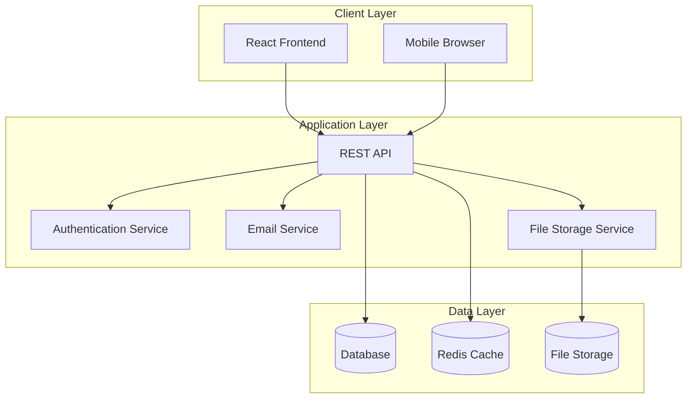
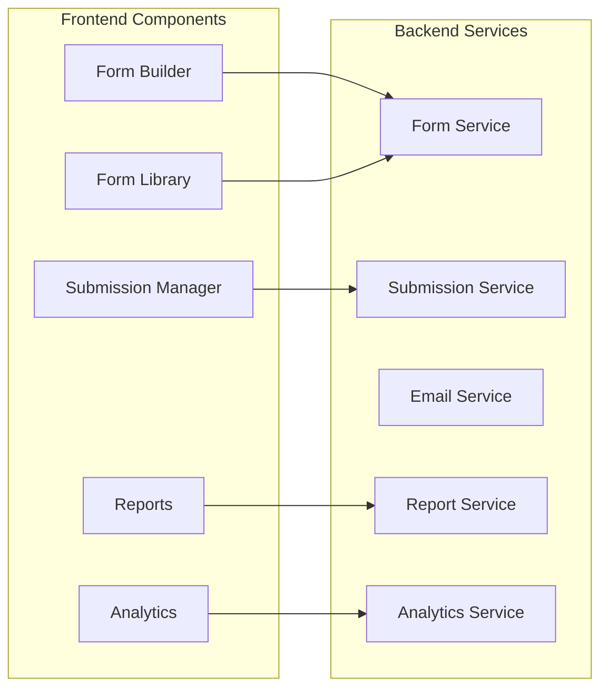
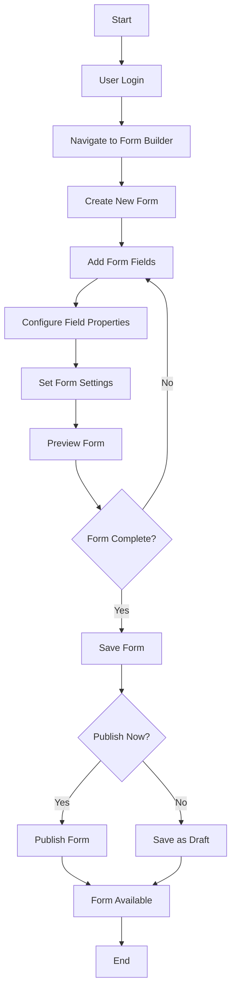
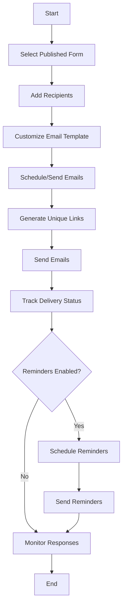
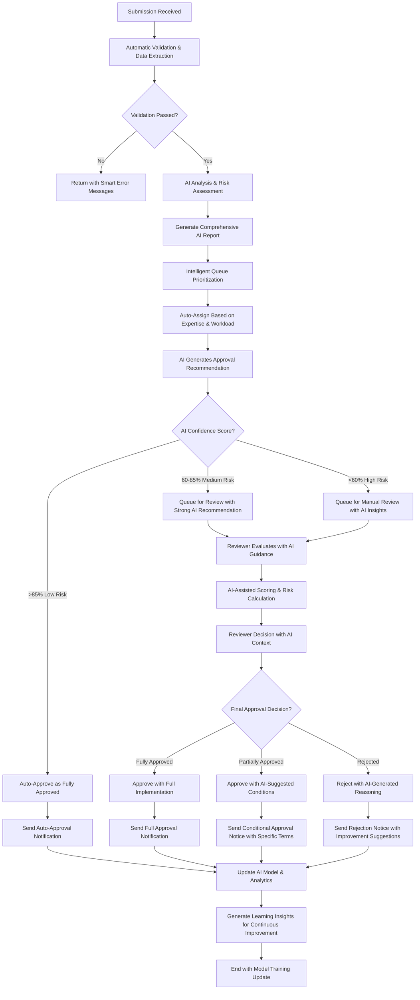
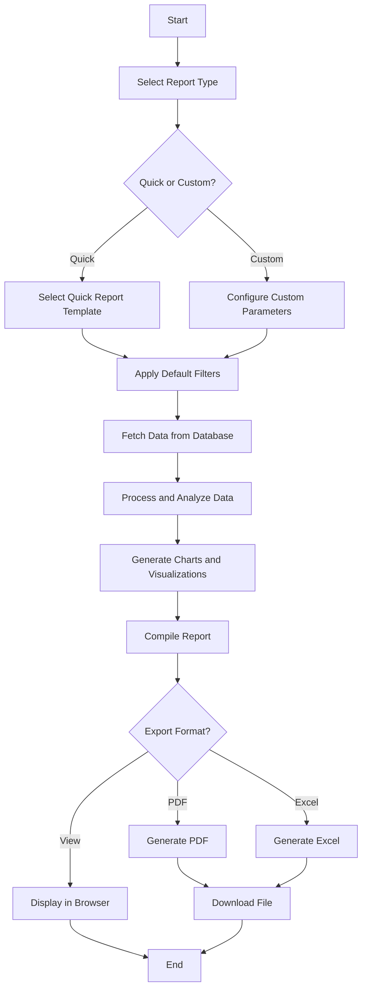
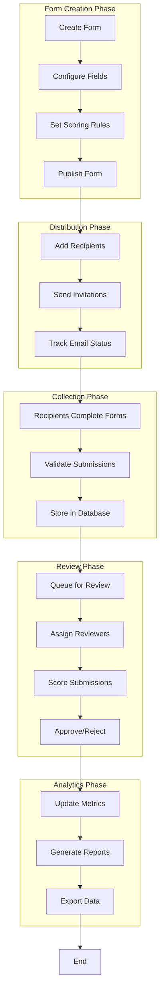

# Software Requirements Specification (SRS)
## Form Builder & Submission Management System

### Version: 1.0
### Date: July 2025

---

## Table of Contents
1. [Introduction](#introduction)
2. [Overall Description](#overall-description)
3. [System Features](#system-features)
4. [External Interface Requirements](#external-interface-requirements)
5. [Non-Functional Requirements](#non-functional-requirements)
6. [System Architecture](#system-architecture)
7. [Data Requirements](#data-requirements)
8. [Use Cases](#use-cases)
9. [System Workflows](#system-workflows)

---

## 1. Introduction

### 1.1 Purpose
This Software Requirements Specification (SRS) document describes the functional and non-functional requirements for a comprehensive Form Builder and Submission Management System. The system enables users to create dynamic forms, distribute them via email, collect submissions, and manage the review and scoring process.

### 1.2 Scope
The system provides:
- **Advanced Form Creation**: Drag-and-drop form builder with 15+ field types and conditional logic
- **Comprehensive Template Management**: 169 industry-specific templates across 8 sectors with advanced filtering
- **Intelligent Email Distribution**: AI-optimized email campaigns with automated reminders and engagement tracking
- **AI-Enhanced Submission Management**: Collection, review, and scoring with machine learning recommendations
- **Advanced Analytics & Reporting**: Real-time dashboards with PDF/Excel export and predictive insights
- **Secure Document Management**: File attachments with virus scanning and cloud storage integration
- **AI-Powered Risk Assessment**: Intelligent scoring, risk categorization, and approval recommendations

### 1.3 Intended Audience
- **Form Creators**: Users who build and configure forms
- **Administrators**: Users who manage the system and review submissions
- **Reviewers**: Users who evaluate and score submissions
- **Recipients**: External users who receive and complete forms
- **Developers**: Technical team maintaining and extending the system

### 1.4 Product Overview
The Form Builder System is a web-based application built with React, TypeScript, and modern web technologies. It provides an intuitive interface for creating complex forms with advanced features like conditional logic, scoring mechanisms, and automated workflows.

---

## 2. Overall Description

### 2.1 Product Perspective
The system operates as a standalone web application with the following components:
- **Frontend**: React-based user interface
- **Backend**: RESTful API (recommended: .NET Core)
- **Database**: Relational database for data persistence
- **File Storage**: Cloud storage for document attachments
- **Email Service**: Integration for email notifications

### 2.2 Product Functions
1. **Form Design and Configuration**
2. **Template Management**
3. **Email Campaign Management**
4. **Submission Collection and Processing**
5. **Review and Scoring Workflows**
6. **Analytics and Reporting**
7. **User Management and Authentication**

### 2.3 User Classes and Characteristics

#### 2.3.1 System Administrator
- **Role**: Complete system access and configuration
- **Technical Level**: High
- **Responsibilities**: User management, system configuration, data maintenance

#### 2.3.2 Form Creator
- **Role**: Creates and manages forms
- **Technical Level**: Medium
- **Responsibilities**: Form design, template creation, basic analytics

#### 2.3.3 Reviewer/Evaluator
- **Role**: Reviews and scores submissions
- **Technical Level**: Low to Medium
- **Responsibilities**: Submission evaluation, scoring, approval/rejection

#### 2.3.4 Form Recipient
- **Role**: Completes submitted forms
- **Technical Level**: Low
- **Responsibilities**: Form completion, document upload

### 2.4 Operating Environment
- **Client Side**: Modern web browsers (Chrome, Firefox, Safari, Edge)
- **Server Side**: Cloud-based hosting (Azure, AWS, or similar)
- **Database**: SQL Server, PostgreSQL, or MySQL
- **Mobile**: Responsive design supporting tablets and smartphones

---

## 3. System Features

### 3.1 Form Builder Module

#### 3.1.1 Description
Provides drag-and-drop interface for creating dynamic forms with various field types.

#### 3.1.2 Functional Requirements
- **FR-FB-001**: System shall provide drag-and-drop form designer
- **FR-FB-002**: System shall support multiple field types (text, email, number, select, checkbox, radio, date, file upload)
- **FR-FB-003**: System shall allow field validation configuration
- **FR-FB-004**: System shall support conditional field display logic
- **FR-FB-005**: System shall enable form preview functionality
- **FR-FB-006**: System shall allow form duplication
- **FR-FB-007**: System shall support form versioning

#### 3.1.3 Input/Output
- **Input**: Form configuration data, field properties, validation rules
- **Output**: Configured form ready for publication

### 3.2 Template Management Module

#### 3.2.1 Description
Manages 160+ industry-specific form templates with advanced filtering and intelligent categorization.

#### 3.2.2 Functional Requirements
- **FR-TM-001**: System shall provide 169 categorized form templates across 8 major sectors
- **FR-TM-002**: System shall support advanced multi-select filtering with real-time counts
- **FR-TM-003**: System shall implement smart categorization with "Multi-Sector", "Multi-Category", and "Other" classifications
- **FR-TM-004**: System shall provide instant search and filtering with sector-specific icons and descriptions
- **FR-TM-005**: System shall allow template customization with inheritance from sector-specific configurations
- **FR-TM-006**: System shall support template sharing and collaboration across users and departments
- **FR-TM-007**: System shall maintain template version history and usage analytics
- **FR-TM-008**: System shall provide template recommendation engine based on user patterns and industry best practices

### 3.3 Email Distribution Module

#### 3.3.1 Description
Manages email campaigns for form distribution with tracking and reminder capabilities.

#### 3.3.2 Functional Requirements
- **FR-ED-001**: System shall send personalized email invitations
- **FR-ED-002**: System shall track email delivery status
- **FR-ED-003**: System shall send automated reminders
- **FR-ED-004**: System shall provide unique form access links
- **FR-ED-005**: System shall support bulk recipient management
- **FR-ED-006**: System shall track email engagement metrics

### 3.4 Submission Management Module

#### 3.4.1 Description
Handles form submission collection, processing, and management.

#### 3.4.2 Functional Requirements
- **FR-SM-001**: System shall collect and store form responses
- **FR-SM-002**: System shall support file attachments
- **FR-SM-003**: System shall validate submissions against form rules
- **FR-SM-004**: System shall provide submission search and filtering
- **FR-SM-005**: System shall support submission status tracking
- **FR-SM-006**: System shall enable submission editing by authorized users

### 3.5 Review and Scoring Module

#### 3.5.1 Description
Provides tools for reviewing, scoring, and approving form submissions.

#### 3.5.2 Functional Requirements
- **FR-RS-001**: System shall support configurable scoring criteria with multiple risk categories and weightings
- **FR-RS-002**: System shall calculate weighted scores using machine learning algorithms
- **FR-RS-003**: System shall assign risk levels (Low, Medium, High, Critical) based on intelligent scoring
- **FR-RS-004**: System shall provide AI-enhanced review workflow management with intelligent approval type recommendations
- **FR-RS-005**: System shall maintain comprehensive audit trail of review activities including AI recommendations vs human decisions
- **FR-RS-006**: System shall support bulk approval/rejection with AI-suggested approval type selection
- **FR-RS-007**: System shall provide AI-driven approval suggestions with confidence scores (>85% for auto-approval)
- **FR-RS-008**: System shall support "Fully Approved" and "Partially Approved" classifications with AI-generated conditions
- **FR-RS-009**: System shall track approval type analytics, AI accuracy metrics, and decision pattern analysis
- **FR-RS-010**: System shall support real-time AI model training based on reviewer feedback and decision outcomes
- **FR-RS-011**: System shall provide AI explainability features showing reasoning behind recommendations

### 3.6 Analytics and Reporting Module

#### 3.6.1 Description
Generates comprehensive reports and analytics on form performance and submissions.

#### 3.6.2 Functional Requirements
- **FR-AR-001**: System shall provide real-time analytics dashboard
- **FR-AR-002**: System shall generate quick reports (executive summary, risk analysis, etc.)
- **FR-AR-003**: System shall support custom report creation
- **FR-AR-004**: System shall export reports in PDF and Excel formats
- **FR-AR-005**: System shall provide submission trend analysis
- **FR-AR-006**: System shall calculate completion rates and performance metrics

---

## 4. External Interface Requirements

### 4.1 User Interfaces
- **Web Interface**: Responsive design supporting desktop and mobile devices
- **Form Interface**: Clean, accessible form completion interface
- **Admin Dashboard**: Comprehensive management interface
- **Email Templates**: Professional email notification templates

### 4.2 Hardware Interfaces
- **Storage**: Integration with cloud storage services (Azure Blob, AWS S3)
- **Printing**: Support for PDF generation and printing

### 4.3 Software Interfaces
- **Database**: SQL Server/PostgreSQL connection
- **Email Service**: SMTP or cloud email service integration
- **Authentication**: JWT token-based authentication
- **File Storage**: Cloud storage API integration

### 4.4 Communication Interfaces
- **HTTP/HTTPS**: RESTful API communication
- **WebSocket**: Real-time notifications (optional)
- **Email Protocols**: SMTP for email delivery

---

## 5. Non-Functional Requirements

### 5.1 Performance Requirements
- **Response Time**: Page load time < 3 seconds
- **Throughput**: Support 1000+ concurrent users
- **Form Submission**: Process submissions in < 2 seconds
- **Report Generation**: Generate reports in < 30 seconds

### 5.2 Security Requirements
- **Authentication**: Multi-factor authentication support
- **Authorization**: Role-based access control
- **Data Encryption**: AES-256 encryption for sensitive data
- **HTTPS**: All communications over encrypted channels
- **Input Validation**: Comprehensive input sanitization

### 5.3 Availability Requirements
- **Uptime**: 99.9% availability
- **Backup**: Daily automated backups
- **Recovery**: Recovery Time Objective (RTO) < 4 hours

### 5.4 Scalability Requirements
- **Horizontal Scaling**: Support for load balancing
- **Database Scaling**: Database clustering support
- **Storage Scaling**: Unlimited file storage capacity

### 5.5 Usability Requirements
- **Learning Curve**: New users productive within 30 minutes
- **Accessibility**: WCAG 2.1 AA compliance
- **Mobile Support**: Full functionality on mobile devices

---

## 6. System Architecture

### 6.1 High-Level Architecture

### 6.2 Component Architecture

---

## 7. Data Requirements

### 7.1 Data Entities
- **Users**: System users with roles and permissions
- **Forms**: Form definitions with fields and settings
- **Form Fields**: Individual form elements with configurations
- **Templates**: Reusable form templates
- **Submissions**: Form responses with metadata
- **Email Recipients**: Email distribution lists
- **Documents**: File attachments and uploads
- **Analytics**: Performance and usage metrics

### 7.2 Data Relationships
- Forms have many Fields (1:N)
- Forms have many Submissions (1:N)
- Submissions have many Documents (1:N)
- Users can create many Forms (1:N)
- Templates can generate many Forms (1:N)

### 7.3 Data Volume Estimates
- **Forms**: 10,000+ forms per organization
- **Submissions**: 100,000+ submissions per year
- **Users**: 1,000+ users per organization
- **Documents**: 1TB+ storage requirement

---

## 8. Use Cases

### 8.1 Primary Use Cases

#### UC-001: Create Form
**Actor**: Form Creator
**Description**: Create a new form using the form builder
**Preconditions**: User is authenticated and has form creation permissions
**Main Flow**:
1. User navigates to form builder
2. User selects "Create New Form"
3. User adds form fields using drag-and-drop
4. User configures field properties and validation
5. User sets form settings and permissions
6. User saves form as draft or publishes immediately

#### UC-002: Distribute Form via Email
**Actor**: Form Creator
**Description**: Send form invitations to recipients
**Preconditions**: Form is published and ready for distribution
**Main Flow**:
1. User navigates to form distribution
2. User adds recipient email addresses
3. User customizes email template
4. User schedules or sends emails immediately
5. System generates unique access links
6. System tracks email delivery status

#### UC-003: Complete Form Submission
**Actor**: Form Recipient
**Description**: Complete and submit a form
**Preconditions**: Recipient receives email invitation
**Main Flow**:
1. Recipient clicks form link in email
2. System displays form interface
3. Recipient completes form fields
4. Recipient uploads required documents
5. Recipient submits form
6. System validates and stores submission

#### UC-004: AI-Enhanced Review and Score Submission
**Actor**: Reviewer
**Description**: Evaluate and score a form submission with comprehensive AI assistance and intelligent recommendations
**Preconditions**: Submission is available for review with AI analysis completed
**Main Flow**:
1. Reviewer accesses intelligent submission queue prioritized by AI risk assessment
2. Reviewer selects submission to review
3. System displays comprehensive AI analysis including:
   - Risk score breakdown and reasoning
   - Approval recommendation with confidence score
   - Suggested approval type (Fully/Partially) with specific conditions
   - Historical pattern analysis and similar case comparisons
4. Reviewer evaluates responses and documents with AI-highlighted key areas
5. Reviewer reviews AI-generated scoring with ability to override individual criteria
6. Reviewer considers AI recommendation and selects approval type:
   - **Fully Approved**: Complete implementation (AI confidence >85%)
   - **Partially Approved**: Conditional implementation with AI-suggested limitations
   - **Rejected**: With AI-generated rejection reasoning template
7. Reviewer adds personalized comments building on AI-generated insights
8. System tracks reviewer decision vs AI recommendation for continuous learning
9. Reviewer submits final decision with approval type and rationale

### 8.2 Secondary Use Cases

#### UC-005: Generate Reports
**Actor**: Administrator/Manager
**Description**: Generate analytics reports
**Main Flow**:
1. User navigates to reports section
2. User selects report type (quick or custom)
3. User configures report parameters
4. System generates report with charts
5. User exports report in desired format

#### UC-006: Manage Templates
**Actor**: Form Creator
**Description**: Create and manage form templates
**Main Flow**:
1. User accesses template library
2. User creates new template from existing form
3. User configures template settings
4. User saves template for reuse
5. Template becomes available to other users

---

## 9. System Workflows

### 9.1 Form Creation Workflow

### 9.2 Email Distribution Workflow

### 9.3 AI-Enhanced Submission Review Workflow

### 9.4 Report Generation Workflow

### 9.5 Complete System Flow

---

## 10. Validation and Verification

### 10.1 Functional Testing
- Unit testing for all components
- Integration testing for API endpoints
- End-to-end testing for complete workflows
- User acceptance testing with stakeholders

### 10.2 Performance Testing
- Load testing with expected user volumes
- Stress testing for peak usage scenarios
- Database performance optimization
- Network latency testing

### 10.3 Security Testing
- Penetration testing for vulnerabilities
- Authentication and authorization testing
- Data encryption verification
- Input validation testing

### 10.4 Usability Testing
- User interface testing across devices
- Accessibility compliance testing
- User experience evaluation
- Cross-browser compatibility testing

---

## 11. Assumptions and Dependencies

### 11.1 Assumptions
- Users have modern web browsers with JavaScript enabled
- Reliable internet connectivity for users
- Email delivery services are available and configured
- Cloud storage services are accessible

### 11.2 Dependencies
- Backend API development (recommended: .NET Core)
- Database setup and configuration
- Email service integration (SendGrid, SMTP)
- Cloud storage setup (Azure Blob, AWS S3)
- SSL certificate for HTTPS

---

## 12. Glossary

- **Form Builder**: Visual interface for creating forms
- **Submission**: Completed form response from a recipient
- **Scoring**: Evaluation process for submissions
- **Risk Level**: Categorization based on submission scores
- **Template**: Pre-configured form structure
- **Workflow**: Automated process for handling submissions
- **Analytics**: Performance metrics and reporting data

---

*This SRS document serves as the technical foundation for developing the Form Builder & Submission Management System. All development activities should align with the requirements specified in this document.*