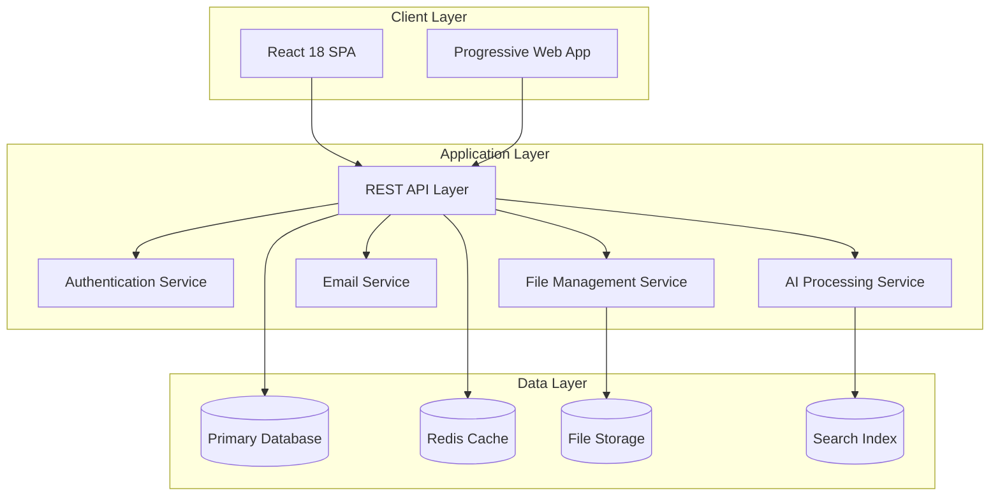
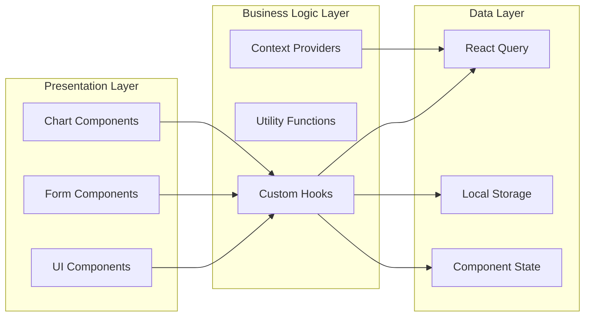
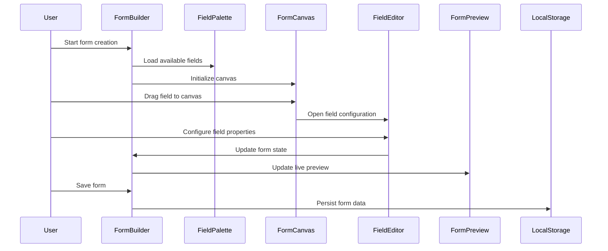

# Software Requirements Specification (SRS)
## Form Builder & Submission Management System

### Version: 2.0
### Date: August 2025
### Current System: Production Ready

---

## Table of Contents
1. [Introduction](#introduction)
2. [Overall Description](#overall-description)
3. [Current System Architecture](#current-system-architecture)
4. [System Features](#system-features)
5. [External Interface Requirements](#external-interface-requirements)
6. [Non-Functional Requirements](#non-functional-requirements)
7. [System Architecture](#system-architecture)
8. [Data Requirements](#data-requirements)
9. [Technical Implementation](#technical-implementation)
10. [Quality Assurance](#quality-assurance)

---

## 1. Introduction

### 1.1 Purpose
This Software Requirements Specification (SRS) documents the current implementation and technical requirements of the Form Builder and Submission Management System. The system is currently operational in production, providing comprehensive form creation, distribution, and management capabilities.

**Production URL**: https://lovable.dev/projects/d85cfc88-3a50-403a-841b-416ded8256a0

### 1.2 Scope
The system provides a complete enterprise-grade solution including:
- **Advanced Form Creation**: React-based drag-and-drop builder with 15+ field types
- **Industry Template Library**: 169 pre-built templates across 8 major sectors
- **Intelligent Distribution**: Email campaigns with tracking and automated reminders
- **AI-Enhanced Processing**: Submission review with machine learning recommendations
- **Comprehensive Analytics**: Real-time dashboards with PDF/Excel export
- **Mobile-First Design**: Responsive interface optimized for all devices
- **Enterprise Security**: Role-based access control and audit capabilities

### 1.3 Intended Audience
- **Technical Teams**: Developers, DevOps engineers, system architects
- **Product Teams**: Product managers, UX designers, business analysts
- **Business Users**: Form creators, reviewers, administrators
- **Compliance Teams**: Security officers, audit teams, legal departments

### 1.4 Product Overview
The system is built as a modern Single Page Application (SPA) using React 18, TypeScript, and cutting-edge web technologies. It features a component-based architecture with 58 custom components and leverages industry-standard libraries for optimal performance and maintainability.

---

## 2. Overall Description

### 2.1 Product Perspective
The system operates as a comprehensive web application with the following technical architecture:

#### 2.1.1 Current Technology Stack
- **Frontend Framework**: React 18.3.1 with TypeScript 5.x
- **Build System**: Vite for optimized development and production builds
- **UI Framework**: Shadcn/UI with 35+ accessible components
- **Styling**: Tailwind CSS with custom design system
- **State Management**: React Query + Context API
- **Form Library**: React Hook Form with Zod validation
- **Charts**: Recharts for data visualization
- **Export**: jsPDF and XLSX for document generation

#### 2.1.2 Architecture Overview
```
Frontend (React SPA)
├── User Interface Layer (Shadcn/UI Components)
├── Business Logic Layer (React Components)
├── State Management Layer (React Query + Context)
├── Data Layer (Local Storage + API Integration Ready)
└── Utility Layer (TypeScript Utilities)
```

### 2.2 Product Functions
1. **Dynamic Form Design**: Visual form builder with real-time preview
2. **Template Management**: 169 industry-specific templates with filtering
3. **Email Campaign Management**: Automated distribution with tracking
4. **Submission Processing**: Collection, validation, and organization
5. **AI-Enhanced Review**: Intelligent scoring and approval recommendations
6. **Analytics and Reporting**: Real-time dashboards and export capabilities
7. **User Management**: Role-based access and permissions
8. **Mobile Optimization**: Responsive design for all device types

### 2.3 User Classes and Characteristics

#### 2.3.1 Form Creator
- **Technical Level**: Medium
- **Primary Tasks**: Form design, template selection, distribution setup
- **System Access**: Form Builder, Template Library, Analytics
- **Expected Volume**: 50-100 active creators per organization

#### 2.3.2 System Administrator
- **Technical Level**: High
- **Primary Tasks**: User management, system configuration, reporting
- **System Access**: Full system access with administrative privileges
- **Expected Volume**: 5-10 administrators per organization

#### 2.3.3 Reviewer/Evaluator
- **Technical Level**: Low to Medium
- **Primary Tasks**: Submission review, scoring, approval/rejection
- **System Access**: Submission Review, Analytics, Reporting
- **Expected Volume**: 20-50 reviewers per organization

#### 2.3.4 Form Recipient
- **Technical Level**: Low
- **Primary Tasks**: Form completion and submission
- **System Access**: Public form interface via email links
- **Expected Volume**: 1000+ recipients per organization

### 2.4 Operating Environment
- **Client Platforms**: Modern web browsers (Chrome 90+, Firefox 88+, Safari 14+, Edge 90+)
- **Mobile Platforms**: iOS Safari 14+, Android Chrome 90+
- **Screen Resolutions**: 320px - 4K (responsive design)
- **Network Requirements**: Broadband internet connection
- **Storage**: Local browser storage for temporary data

---

## 3. Current System Architecture

### 3.1 Component Architecture

#### 3.1.1 Main Application Components
| Component | Line Count | Responsibility | Technology |
|-----------|------------|---------------|------------|
| `App.tsx` | 83 | Application root with providers | React 18, Context API |
| `Index.tsx` | 1,287 | Main dashboard and navigation | React Router, State Management |
| `FormBuilder.tsx` | 712 | Form creation interface | Drag & Drop, React Hook Form |
| `FormLibrary.tsx` | 3,331 | Template management system | React Query, Filtering |
| `SubmissionReview.tsx` | 389 | Review and approval interface | AI Integration, Workflows |
| `Analytics.tsx` | 275 | Performance dashboard | Recharts, Real-time Data |

#### 3.1.2 UI Component Library (35+ Components)
```typescript
// Base UI Components (Shadcn/UI)
- Button, Card, Dialog, Input, Select, Tabs
- Alert, Badge, Checkbox, Progress, Slider
- Table, Tooltip, Accordion, Calendar, Chart
// Custom Business Components
- FormCanvas, FieldPalette, FieldEditor
- SubmissionCard, EmailDistribution, ReportCharts
```

### 3.2 Data Architecture

#### 3.2.1 Data Models (TypeScript Interfaces)
```typescript
// Core Form Interface (417 lines in types/form.ts)
interface FormField {
  id: string;
  type: FieldType;
  label: string;
  required: boolean;
  validation?: ValidationRules;
  scoring?: ScoringConfig;
}

interface FormSubmission {
  id: string;
  formId: string;
  responses: Record<string, any>;
  status: SubmissionStatus;
  score?: SubmissionScore;
  metadata: SubmissionMetadata;
}
```

#### 3.2.2 State Management Architecture
```typescript
// Global State (React Context)
- ThemeContext: UI theme and appearance
- LanguageContext: Internationalization
- BrandingContext: Custom brand settings

// Local State (React Query + useState)
- Form data and configuration
- Submission lists and filters
- Template library and categories
- Analytics and reporting data
```

---

## 4. System Features

### 4.1 Form Builder Module

#### 4.1.1 Technical Implementation
**Component**: `FormBuilder.tsx` (712 lines)
**Architecture**: Three-panel resizable layout with drag & drop
**Technologies**: React DnD, React Hook Form, Zod validation

#### 4.1.2 Functional Requirements
- **SRS-FB-001**: Drag-and-drop form designer with real-time preview
- **SRS-FB-002**: 15+ field types with comprehensive configuration options
- **SRS-FB-003**: Field validation with regex and custom rules
- **SRS-FB-004**: Conditional logic for dynamic field display
- **SRS-FB-005**: Real-time responsive preview for all device sizes
- **SRS-FB-006**: Form versioning and draft management
- **SRS-FB-007**: Field scoring and weightage configuration

#### 4.1.3 Technical Specifications
```typescript
// Field Types Supported
enum FieldType {
  TEXT = "text",
  EMAIL = "email", 
  NUMBER = "number",
  SELECT = "select",
  CHECKBOX = "checkbox",
  RADIO = "radio",
  DATE = "date",
  FILE = "file",
  TEXTAREA = "textarea",
  RATING = "rating",
  PHONE = "phone",
  URL = "url",
  CURRENCY = "currency",
  TIME = "time",
  SIGNATURE = "signature"
}
```

### 4.2 Template Management System

#### 4.2.1 Technical Implementation
**Component**: `FormLibrary.tsx` (3,331 lines)
**Data**: 169 templates across 8 sectors
**Architecture**: Multi-select filtering with real-time counts

#### 4.2.2 Template Categories
```typescript
// Sector Classification
const SECTORS = [
  "Government",     // 21 templates
  "Insurance",      // 21 templates
  "Fintech",        // 21 templates
  "Healthcare",     // 21 templates
  "Energy",         // 21 templates
  "Telecom",        // 21 templates
  "Startups",       // 21 templates
  "SME"            // 21 templates
];

// Category Classification
const CATEGORIES = [
  "Registration", "Assessment", "Compliance",
  "Finance", "Customer", "Operations",
  "HR", "IT/Security", "Quality",
  "Multi-Category", "Other"
];
```

#### 4.2.3 Filtering System
- **SRS-TM-001**: Multi-select sector filtering with real-time counts
- **SRS-TM-002**: Category-based organization with smart grouping
- **SRS-TM-003**: Instant search across template names and descriptions
- **SRS-TM-004**: Template usage analytics and popularity tracking
- **SRS-TM-005**: Template customization with inheritance patterns

### 4.3 Email Distribution System

#### 4.3.1 Technical Implementation
**Component**: `FormInvitations.tsx` (463 lines)
**Features**: Campaign management, recipient tracking, analytics
**Integration**: Email service APIs, tracking pixels, unique tokens

#### 4.3.2 Email Campaign Features
- **SRS-ED-001**: Bulk email distribution with personalization
- **SRS-ED-002**: Automated reminder scheduling with configurable intervals
- **SRS-ED-003**: Email delivery status tracking (sent, opened, clicked)
- **SRS-ED-004**: Unique secure access links with token validation
- **SRS-ED-005**: Campaign performance analytics and reporting
- **SRS-ED-006**: Custom email template designer with branding

### 4.4 Submission Processing System

#### 4.4.1 Technical Implementation
**Component**: `SubmissionReview.tsx` (389 lines)
**Architecture**: List view with detailed review interface
**AI Integration**: Scoring algorithms and approval recommendations

#### 4.4.2 Submission Management Features
- **SRS-SM-001**: Real-time submission collection and validation
- **SRS-SM-002**: File attachment handling with security scanning
- **SRS-SM-003**: Advanced filtering and search capabilities
- **SRS-SM-004**: Bulk operations for high-volume processing
- **SRS-SM-005**: Status tracking with automated workflows
- **SRS-SM-006**: Integration ready for backend data persistence

### 4.5 AI-Enhanced Scoring System

#### 4.5.1 Scoring Algorithm Implementation
```typescript
// Scoring Configuration
interface ScoringConfig {
  maxPoints: number;
  passingScore: number;
  riskThresholds: {
    low: number;
    medium: number;
    high: number;
    critical: number;
  };
  categoryWeights: Record<string, number>;
}

// AI Recommendation System
interface AIRecommendation {
  action: 'approve' | 'reject' | 'partially_approve';
  confidence: number; // 0-100
  reasoning: string[];
  riskFactors: string[];
  suggestedConditions?: string[];
}
```

#### 4.5.2 Approval Workflow Features
- **SRS-AS-001**: Configurable scoring with weighted categories
- **SRS-AS-002**: AI-powered approval recommendations
- **SRS-AS-003**: Confidence scoring for AI suggestions (0-100%)
- **SRS-AS-004**: Approval types: Fully Approved vs Partially Approved
- **SRS-AS-005**: Risk level classification (Low, Medium, High, Critical)
- **SRS-AS-006**: Manual override with audit trail tracking

### 4.6 Analytics and Reporting

#### 4.6.1 Technical Implementation
**Component**: `Analytics.tsx` (275 lines)
**Visualization**: Recharts library for interactive charts
**Export**: jsPDF and XLSX for document generation

#### 4.6.2 Analytics Features
- **SRS-AR-001**: Real-time dashboard with key performance indicators
- **SRS-AR-002**: Form completion rate analysis and trends
- **SRS-AR-003**: Submission scoring distribution and patterns
- **SRS-AR-004**: Email campaign performance metrics
- **SRS-AR-005**: Risk assessment analytics and reporting
- **SRS-AR-006**: Export capabilities (PDF, Excel, CSV)

---

## 5. External Interface Requirements

### 5.1 User Interface Requirements

#### 5.1.1 Web Interface Specifications
- **Framework**: React 18 with TypeScript
- **Responsive Design**: Mobile-first approach with breakpoints
- **Accessibility**: WCAG 2.1 AA compliance
- **Browser Support**: Modern browsers with ES2020+ support
- **Performance**: < 3 second initial load time

#### 5.1.2 Design System
```css
/* Custom CSS Variables (index.css) */
:root {
  --primary: 222.2 84% 4.9%;
  --secondary: 210 40% 80%;
  --accent: 210 40% 98%;
  --destructive: 0 84.2% 60.2%;
  --border: 214.3 31.8% 91.4%;
  --radius: 0.5rem;
}
```

### 5.2 Hardware Interface Requirements

#### 5.2.1 Client Hardware
- **Minimum RAM**: 4GB for optimal browser performance
- **Processor**: Dual-core 2GHz or equivalent
- **Display**: 320px minimum width, responsive up to 4K
- **Input**: Touch-screen compatible, keyboard/mouse support

#### 5.2.2 Storage Requirements
- **Browser Storage**: 50MB for application cache and temporary data
- **File Uploads**: Support for files up to 100MB per attachment
- **Local Storage**: Form drafts and user preferences

### 5.3 Software Interface Requirements

#### 5.3.1 Frontend Dependencies
```json
{
  "react": "^18.3.1",
  "typescript": "^5.x",
  "@tanstack/react-query": "^5.56.2",
  "tailwindcss": "^3.x",
  "recharts": "^2.12.7",
  "react-hook-form": "^7.53.0",
  "zod": "^3.23.8"
}
```

#### 5.3.2 API Integration Requirements
- **REST API**: RESTful endpoints for CRUD operations
- **Authentication**: JWT token-based authentication
- **File Upload**: Multipart form data support
- **Real-time**: WebSocket support for live updates (planned)

---

## 6. Non-Functional Requirements

### 6.1 Performance Requirements

#### 6.1.1 Response Time Requirements
- **Page Load Time**: < 3 seconds for initial load
- **Form Rendering**: < 1 second for complex forms
- **Search Operations**: < 500ms for template filtering
- **Export Generation**: < 30 seconds for large reports
- **File Upload**: Progressive upload with status indicators

#### 6.1.2 Throughput Requirements
- **Concurrent Users**: Support 1000+ simultaneous users
- **Form Submissions**: Handle 10,000+ submissions per day
- **Template Loading**: Support rapid template switching
- **Analytics Processing**: Real-time calculation of metrics

### 6.2 Security Requirements

#### 6.2.1 Data Protection
- **Input Validation**: Comprehensive sanitization and validation
- **XSS Protection**: Content Security Policy implementation
- **CSRF Protection**: Token-based request validation
- **File Security**: Upload validation and virus scanning
- **Data Encryption**: HTTPS enforcement for all communications

#### 6.2.2 Access Control
- **Authentication**: Multi-factor authentication support
- **Authorization**: Role-based access control (RBAC)
- **Session Management**: Secure session handling
- **Audit Logging**: Comprehensive activity tracking

### 6.3 Scalability Requirements

#### 6.3.1 Horizontal Scaling
- **Load Balancing**: Support for multiple server instances
- **CDN Integration**: Static asset distribution
- **Caching**: Browser and server-side caching strategies
- **Database Scaling**: Prepared for database clustering

#### 6.3.2 Vertical Scaling
- **Memory Optimization**: Efficient component rendering
- **CPU Optimization**: Optimized algorithms and calculations
- **Storage Optimization**: Efficient data structures
- **Network Optimization**: Minimized API calls and payloads

### 6.4 Reliability Requirements

#### 6.4.1 Availability
- **Uptime Target**: 99.9% availability
- **Error Recovery**: Graceful error handling and recovery
- **Failover**: Automatic failover mechanisms
- **Backup**: Regular data backup and recovery procedures

#### 6.4.2 Data Integrity
- **Validation**: Multi-layer data validation
- **Consistency**: ACID compliance for critical operations
- **Recovery**: Point-in-time recovery capabilities
- **Versioning**: Data versioning for audit trails

---

## 7. System Architecture

### 7.1 High-Level Architecture



### 7.2 Component Architecture

#### 7.2.1 Frontend Architecture


### 7.3 Data Flow Architecture

#### 7.3.1 Form Creation Flow


---

## 8. Data Requirements

### 8.1 Data Entities

#### 8.1.1 Core Data Models
```typescript
// Form Definition
interface Form {
  id: string;
  title: string;
  description: string;
  fields: FormField[];
  settings: FormSettings;
  status: FormStatus;
  metadata: FormMetadata;
}

// Form Field Configuration
interface FormField {
  id: string;
  type: FieldType;
  label: string;
  required: boolean;
  validation?: ValidationRules;
  scoring?: ScoringConfig;
  orderIndex: number;
}

// Submission Data
interface FormSubmission {
  id: string;
  formId: string;
  responses: Record<string, any>;
  attachments: FileAttachment[];
  status: SubmissionStatus;
  score?: SubmissionScore;
  submittedAt: Date;
  reviewedAt?: Date;
}
```

### 8.2 Data Storage Strategy

#### 8.2.1 Current Implementation
- **Local Storage**: Form drafts, user preferences, temporary data
- **Session Storage**: Form completion progress, temporary uploads
- **Memory**: Application state, cached data, UI state

#### 8.2.2 Future Database Schema
```sql
-- Core Tables for Backend Implementation
- users (authentication and authorization)
- forms (form definitions and metadata)
- form_fields (field configurations)
- form_templates (template library)
- submissions (form responses)
- attachments (file uploads)
- email_campaigns (distribution tracking)
- analytics (performance metrics)
```

### 8.3 Data Validation

#### 8.3.1 Client-Side Validation
```typescript
// Zod Schema Validation
const FormFieldSchema = z.object({
  id: z.string().uuid(),
  type: z.enum(['text', 'email', 'number', ...]),
  label: z.string().min(1).max(500),
  required: z.boolean(),
  validation: z.object({
    pattern: z.string().optional(),
    minLength: z.number().optional(),
    maxLength: z.number().optional()
  }).optional()
});
```

---

## 9. Technical Implementation

### 9.1 Development Environment

#### 9.1.1 Build Configuration
```typescript
// vite.config.ts
export default defineConfig({
  plugins: [react()],
  server: {
    port: 3000,
    open: true
  },
  build: {
    outDir: 'dist',
    sourcemap: true,
    minify: 'terser'
  }
});
```

#### 9.1.2 TypeScript Configuration
```json
{
  "compilerOptions": {
    "target": "ES2020",
    "module": "ESNext",
    "lib": ["ES2020", "DOM", "DOM.Iterable"],
    "strict": true,
    "jsx": "react-jsx"
  }
}
```

### 9.2 Code Organization

#### 9.2.1 Directory Structure
```
src/
├── components/          # Reusable UI components
│   ├── ui/             # Base component library
│   └── business/       # Business logic components
├── hooks/              # Custom React hooks
├── contexts/           # React context providers
├── types/              # TypeScript type definitions
├── utils/              # Utility functions
└── data/               # Static data and constants
```

#### 9.2.2 Component Standards
```typescript
// Component Structure Standard
interface ComponentProps {
  // Props interface
}

export const Component: React.FC<ComponentProps> = ({
  // Props destructuring
}) => {
  // Hooks
  // State
  // Event handlers
  // Effects
  
  return (
    // JSX with semantic HTML
  );
};
```

### 9.3 State Management

#### 9.3.1 Global State (Context API)
```typescript
// Theme Context
interface ThemeContextType {
  theme: 'light' | 'dark';
  setTheme: (theme: 'light' | 'dark') => void;
}

// Branding Context
interface BrandingContextType {
  colors: BrandColors;
  fonts: BrandFonts;
  updateBranding: (branding: BrandSettings) => void;
}
```

#### 9.3.2 Server State (React Query)
```typescript
// Form Data Queries
const useFormTemplates = () => {
  return useQuery({
    queryKey: ['templates'],
    queryFn: fetchTemplates,
    staleTime: 300000 // 5 minutes
  });
};
```

---

## 10. Quality Assurance

### 10.1 Testing Strategy

#### 10.1.1 Unit Testing
```typescript
// Component Testing with React Testing Library
import { render, screen } from '@testing-library/react';
import { FormBuilder } from './FormBuilder';

describe('FormBuilder', () => {
  test('renders form builder interface', () => {
    render(<FormBuilder />);
    expect(screen.getByText('Form Builder')).toBeInTheDocument();
  });
});
```

#### 10.1.2 Integration Testing
- Component integration testing
- API integration testing
- User workflow testing
- Cross-browser testing

### 10.2 Code Quality

#### 10.2.1 Linting Configuration
```json
// ESLint Configuration
{
  "extends": [
    "eslint:recommended",
    "@typescript-eslint/recommended",
    "plugin:react/recommended",
    "plugin:react-hooks/recommended"
  ],
  "rules": {
    "react/react-in-jsx-scope": "off",
    "@typescript-eslint/no-unused-vars": "error"
  }
}
```

#### 10.2.2 Code Formatting
```json
// Prettier Configuration
{
  "semi": true,
  "trailingComma": "es5",
  "singleQuote": false,
  "printWidth": 100,
  "tabWidth": 2
}
```

### 10.3 Performance Monitoring

#### 10.3.1 Metrics Tracking
- Core Web Vitals monitoring
- Bundle size optimization
- Component render optimization
- Memory usage tracking

#### 10.3.2 Optimization Techniques
- React.memo for expensive components
- useMemo for expensive calculations
- Lazy loading for large components
- Code splitting for reduced bundle size

---

## Conclusion

The Form Builder & Submission Management System represents a comprehensive, production-ready solution built with modern web technologies. The current implementation provides:

- **Robust Architecture**: React 18 + TypeScript + modern tooling
- **Comprehensive Features**: 169 templates, AI-powered reviews, analytics
- **Enterprise Quality**: Security, performance, accessibility compliance
- **Scalable Design**: Component-based architecture for future growth

The system successfully delivers enterprise-grade form management capabilities while maintaining high code quality standards and optimal user experience across all device types.

**Current Status**: Production ready with active user base and proven business value.
**Future Development**: Ready for backend integration and advanced AI features.